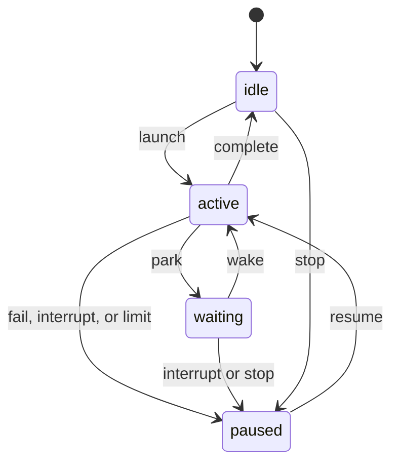

# Pollytool as a Library

Pollytool's CLI is a thin layer over Go packages you can use directly: one
streaming interface over seven LLM providers, plus tools, sandboxing,
skills, sessions, and structured output.

**Contents:** [Quick Start](#quick-start) · [Helpers](#helpers) ·
[Core Types](#core-types) · [Providers](#providers) · [Tools](#tools) ·
[Shell Tools](#shell-tools) · [MCP Servers](#mcp-servers) ·
[Skills](#skills) · [Sessions](#sessions) ·
[Structured Output](#structured-output) · [Error Handling](#error-handling) ·
[Thread Safety](#thread-safety)

## Quick Start

```bash
go get github.com/alexschlessinger/pollytool
export POLLYTOOL_OPENAIKEY=...   # also POLLYTOOL_ANTHROPICKEY, POLLYTOOL_GEMINIKEY,
                                 # POLLYTOOL_OLLAMAKEY, POLLYTOOL_HUGGINGFACEKEY
```

```go
import "github.com/alexschlessinger/pollytool/llm"

// One-shot: model, prompt, token budget
joke, err := llm.QuickComplete(ctx, "openai/gpt-5.4", "Tell me a joke", 500)

// Streaming
err = llm.StreamComplete(ctx, "openai/gpt-5.4", "Write a short story", 500, func(chunk string) {
    fmt.Print(chunk)
})
```

`llm.GetDefaultClient()` reads the `POLLYTOOL_*KEY` variables above. For
DeepSeek and OpenRouter, pass `deepseek` / `openrouter` keys to
`llm.NewMultiPass` yourself.

## Helpers

The one-liners build a fresh router from the environment on every call,
which is fine for scripts. For many calls, create one client with
`llm.GetDefaultClient()` (or `llm.NewMultiPass`) and reuse it.

### Conversation with history

```go
history := []messages.ChatMessage{
    {Role: messages.MessageRoleSystem, Content: "You are helpful"},
    {Role: messages.MessageRoleUser, Content: "Hi"},
    {Role: messages.MessageRoleAssistant, Content: "Hello! How can I help?"},
}
reply, err := llm.ChatWithHistory(ctx, "openai/gpt-5.4", history, "What did I just say?", 1000)
fmt.Println(reply.Content)
```

### Structured output, the easy way

`llm.SchemaFor` reflects a JSON schema from a struct; `StructuredComplete`
unmarshals the answer back into it:

```go
type UserInfo struct {
    Name  string `json:"name"`
    Age   int    `json:"age,omitempty"`
    Email string `json:"email"`
}

var user UserInfo
err := llm.StructuredComplete(ctx, "openai/gpt-5.4",
    "Extract: John Doe, 30, john@example.com",
    llm.SchemaFor(UserInfo{}), 500, &user)
```

### The builder

```go
client := llm.GetDefaultClient()

result, err := llm.NewCompletionBuilder("openai/gpt-5.4").
    WithSystemPrompt("You are a helpful assistant").
    WithUserMessage("Tell me about Go").
    WithTemperature(0.8).
    WithMaxTokens(500).
    Execute(ctx, client)

// Streaming variant
err = llm.NewCompletionBuilder("openai/gpt-5.4").
    WithUserMessage("Write a haiku").
    ExecuteStreaming(ctx, client, func(chunk string) { fmt.Print(chunk) })

// Tool loop: executes each call the model makes, feeds results back, and
// returns the final answer. Capped at 1024 rounds; hitting the cap returns
// the last response together with ErrMaxIterations.
registry := tools.NewToolRegistry([]tools.Tool{&WeatherTool{}})
response, err := llm.NewCompletionBuilder("openai/gpt-5.4").
    WithUserMessage("What's the weather in NYC?").
    ExecuteWithTools(ctx, client, registry)

// Skills work on the builder too: .WithSkills(catalog)
```

`ExecuteWithTools` runs the same engine as `Agent.Run`, with tools executed
sequentially in request order. It keeps reasoning, typed tool results, and media,
and records interrupted results when a batch aborts. Tool exchanges are appended
to the builder's history; the final answer is returned separately. The supplied
registry stays caller-owned. An explicit `WithTools` selection controls advertised
schemas; execution still checks the registry's current policy. Without a selection,
schemas follow the registry between rounds. The builder adds no private tools.

Malformed arguments, missing tools, and policy-blocked calls now become failed
tool results that the model can correct, matching `Agent.Run`. Provider failures
and aborted runs return errors with any available partial response. Provider stop
reasons follow Agent semantics, including content-filter errors and completion on
`end_turn` or `max_tokens`. A nil registry still performs one completion and returns
any tool calls without executing them.

## Core Types

Every provider implements one method:

```go
type LLM interface {
    ChatCompletionStream(context.Context, *CompletionRequest, EventStreamProcessor) <-chan *messages.StreamEvent
}
```

The processor turns raw chunks into stream events;
`messages.NewStreamProcessor()` is the standard implementation.

```go
type CompletionRequest struct {
    APIKey   string
    BaseURL  string        // Custom endpoint (OpenAI-compatible providers)
    Timeout  time.Duration // Stream stall budget: cancel after this much silence (0 disables)
    Deadline time.Duration // Hard per-call ceiling (0 = none)

    // nil means "don't send temperature" — required for reasoning models,
    // which reject the parameter. Use llm.Float32Ptr(0.7) to set it.
    Temperature *float32

    Model            string
    MaxTokens        int
    MaxContextTokens int             // Agent's estimated input budget (0 = unlimited)
    Messages         []messages.ChatMessage
    Tools            []tools.Tool
    ResponseSchema   *Schema         // JSON schema for structured output
    ThinkingEffort   ThinkingEffort  // llm.EffortOff(), EffortLevel(LevelHigh), EffortBudget(n), EffortDynamic()
    Stream           *bool           // nil = streaming (default), false = non-streaming
    Skills           *skills.Catalog // Injects the skill prompt into the system prompt
}

type ChatMessage struct {
    Role       string                // "system", "user", "assistant", "tool", "internal"
    Content    string
    Parts      []ContentPart         // Multimodal content (images, files)
    ToolCalls  []ChatMessageToolCall // Tool calls made by the assistant
    ToolCallID string                // Set on tool-role replies
    ToolName   string                // Tool name on tool-role replies
    Reasoning  string                // Model reasoning, when the provider exposes it
    Metadata   map[string]any        // Token counts, error flags, etc.
    StopReason StopReason
}

type ChatMessageToolCall struct {
    ID        string
    Name      string
    Arguments string // JSON-encoded
}
```

Roles are the constants `messages.MessageRoleSystem`, `MessageRoleUser`,
`MessageRoleAssistant`, `MessageRoleTool`, and `MessageRoleInternal` (app
state; filter it before sending upstream). `messages.User("hello")` builds a
one-message user history.

`AgentCallbacks.BeforeFirstRequest` runs once per `Run`, after the initial
projection succeeds and before the first provider call, with that projection's
statistics. Persist a new user message there: a request that cannot be sent (a
prompt that does not fit after clamping and deterministic reductions, a
selected image that cannot be read) returns from `Run` before that point with
nothing generated, and an error returned from the callback aborts the run
before any provider call. Set `MaxContextTokens` to the effective input budget
before running.

Two optional, nil-safe callbacks expose live accounting without inspecting
rendered output:

```go
OnRequestProjection func(iteration int, stats ProjectionStats)
OnIterationUsage    func(iteration, inputTokens, outputTokens int)
```

`OnRequestProjection` runs after each successful projection and before its
provider request. On the first iteration it follows the successful
`BeforeFirstRequest` persistence gate; a veto or projection failure emits no
request callback. `OnIterationUsage` runs after a provider iteration completes,
before its tools execute, with measured usage (zero when unavailable).
Iterations are zero-based within each `Run`, including subsequent runs of the
same agent. Store usage by iteration and replace repeated samples when
reconciling; the CLI's turn totals use peak input and summed output tokens.
Context usage follows the latest request's projection until that same request
reports measured input, even if projections shrink between iterations.

Persist `AgentResponse.AllMessages` with their content parts intact, including
on partial runs. Generated assistant messages may carry artifact references
created while compacting older tool results. Those references keep the stored
outputs discoverable after a reload or context-budget increase; they are
removed from provider-visible messages during projection.

`ChatCompletionStream` sends events on a channel as the response arrives:

```go
type StreamEvent struct {
    Type     StreamEventType
    Content  string          // Incremental text (content and reasoning chunks)
    ToolCall *tools.ToolCall // For tool_call events
    Message  *ChatMessage    // For the final complete event
    Error    error           // For error events
}

const (
    EventTypeContent   StreamEventType = "content"
    EventTypeReasoning StreamEventType = "reasoning"
    EventTypeToolCall  StreamEventType = "tool_call"
    EventTypeComplete  StreamEventType = "complete"  // Final assembled message
    EventTypeError     StreamEventType = "error"
)
```

## Providers

`MultiPass` routes on a `provider/model` prefix — `openai/gpt-5.4`,
`anthropic/claude-opus-4-7`, `gemini/gemini-3.1-pro-preview`,
`ollama/gpt-oss`, `huggingface/...`, `deepseek/...`, `openrouter/...`. It is
constructs provider clients per call and shares a scoped metadata cache.

```go
multipass := llm.NewMultiPass(map[string]string{
    "openai":    os.Getenv("POLLYTOOL_OPENAIKEY"),
    "anthropic": os.Getenv("POLLYTOOL_ANTHROPICKEY"),
})
// or llm.GetDefaultClient() to load the OpenAI, Anthropic, Gemini, Ollama and
// Hugging Face keys from the environment; pass DeepSeek/OpenRouter keys to
// llm.NewMultiPass explicitly.

req := &llm.CompletionRequest{
    Model:       "anthropic/claude-opus-4-7",
    Messages:    messages.User("Hello, how are you?"),
    Temperature: llm.Float32Ptr(0.7),
    MaxTokens:   1000,
    Timeout:     30 * time.Second,
}

for event := range multipass.ChatCompletionStream(ctx, req, messages.NewStreamProcessor()) {
    switch event.Type {
    case messages.EventTypeContent:
        fmt.Print(event.Content)
    case messages.EventTypeComplete:
        fmt.Printf("\nComplete: %+v\n", event.Message)
    case messages.EventTypeError:
        fmt.Printf("Error: %v\n", event.Error)
    }
}
```

### Model metadata and request capabilities

`MultiPass.ListModels(ctx, ModelTarget, refresh)` lists a provider catalog;
`LookupModel` retrieves a model and its advertised routes. `Agent` exposes the same
methods. `ModelTarget` takes `Provider`, a bare `Model` ID, optional `Host`,
`BaseURL`, and `APIKey`. Omitted credentials use inference's effective runtime key.
`UseConfiguredKey: true` with an empty `APIKey` bypasses the process override for
a preview of clearing it. Explicit preview keys do not change inference credentials;
neither credential field is serialized.
`GetModelInfo` provides the optional `ModelMetadataProvider` interface.
`DiscoverModelContextWindow` remains a compatibility wrapper over this service.

```go
multipass.SetModelMetadataCache(store) // optional: *sessions.SQLiteStore implements this
catalog, err := multipass.ListModels(ctx, llm.ModelTarget{Provider: "openrouter"}, false)
detail, err := multipass.LookupModel(ctx, llm.ModelTarget{
    Provider: "openrouter", Model: "org/model", Host: "upstream/routing-id",
}, false)
_ = catalog
_ = detail
_ = err
```

The optional store interface has `GetModelCache(context.Context, string) ([]byte, error)`
and `PutModelCache(context.Context, string, []byte) error`. Entries are separate from
conversation history. The additive SQLite v7 migration creates this table for disk
and memory stores. Scope hashes include provider, effective endpoint, credential,
model, and host; no credential is serialized. Freshness is one hour. Stale data is
returned immediately while a bounded refresh runs. Failures retain successful data
and suppress automatic attempts for one minute; `refresh=true` bypasses freshness
and failure cooldown. Concurrent reads coalesce. HTTP work is limited to four
concurrent fetches, ten seconds per fetch, and 16 MiB per response. Caller
cancellation stops uncached reads; background stale refreshes have their own deadline.

`ModelCatalog` reports `Source`, `FetchedAt`, `Partial`, `Stale`, and `Error`.
Partial catalogs may contain usable records. Model and endpoint facts stay separate:
identity, display text, lifecycle, input/output modalities, token limits, tools,
structured output, reasoning choices, parameter declarations, sampling metadata,
image constraints, pricing, and performance. Provider additions are inspectable in
bounded `Raw` records. Descriptions are display data and never enter model prompts.
Nil capability pointers/lists mean unknown; explicit false, zero, and empty lists
remain distinct. `UnlimitedLimits` is an explicit declaration keyed by normalized
limit name, never inferred from absent/zero fields. `LimitsApplyToAllRoutes` marks
an explicitly applicable model-wide limit; catalog maxima do not set it. Missing price units remain
unknown; normalized `Prices` retain their currency, amount, basis, and conditions.

Discovery uses only provider APIs: OpenAI and DeepSeek Models; paginated Anthropic
and Gemini Models; Ollama tags and lazy show (no downloads); Hugging Face router
model/detail records; OpenRouter models and lazy endpoints. Source contracts:
[OpenAI](https://platform.openai.com/docs/api-reference/models),
[Anthropic](https://platform.claude.com/docs/en/api/models/retrieve),
[Gemini](https://ai.google.dev/api/models),
[Ollama](https://docs.ollama.com/api/show),
[DeepSeek](https://api-docs.deepseek.com/api/list-models),
[Hugging Face](https://huggingface.co/docs/inference-providers/hub-api),
[OpenRouter](https://openrouter.ai/docs/api/api-reference/endpoints/list-all-endpoints-for-a-model).

`CompletionRequest.ModelHost` pins an OpenRouter routing ID using `provider.only`
with fallbacks disabled. Empty means Automatic. Other providers reject this field;
Hugging Face uses its existing `model:host` suffix. An explicit child model clears
an inherited pin unless another pin is supplied (`subagent.Request.ModelHost`,
spawn tool `model_host`, or workflow `modelHost`).

`Agent.Run` and `MultiPass` prepare a copied outgoing request before dispatch.
Custom clients can implement `ModelMetadataProvider`, or callers can set
`CompletionRequest.Capabilities` to normalized authoritative facts. Without either,
capabilities stay unknown. `ModelInfo.EffectiveCapabilities(host)` resolves endpoint
overrides and conservative Automatic guarantees. Explicit `MaxContextTokens`
values take precedence over discovered constraints; zero means unlimited.
Callers wanting a model-derived budget can use `ContextWindow()` and
`ClampContextBudget` to reserve output headroom before setting the request budget.

`PrepareCapabilities` also exposes adaptation independently. Unsupported media is
replaced with text identifying what the model could not view, without hydrating
or rewriting stored image parts. Optional tools and unsupported settings are
omitted; completed tool protocol exchanges become associated text. An explicitly
unsupported response schema or required successful response tool is an error.
Reasoning choices are validated only for complete declarations. Diagnostics arrive
through `CompletionRequest.OnAdaptation` and `AgentCallbacks.OnAdaptation` as
`RequestAdaptation{Feature, Count, Message}`. Accounting and shape caches use the
adapted projection. No retry, model switch, or image batching occurs.

Direct provider clients skip the router and take bare model names
(`"gpt-5.4"`, not `"openai/gpt-5.4"`):

```go
openai := llm.NewOpenAIClient(apiKey, "")                   // second arg = optional base URL
anthropic := llm.NewAnthropicClient(apiKey)
gemini, err := llm.NewGeminiClient(apiKey)
ollama := llm.NewOllamaClient("http://localhost:11434", "") // baseURL first; key optional
```

## Tools

```go
type Tool interface {
    GetSchema() *schema.ToolSchema
    Execute(ctx context.Context, args map[string]any) (string, error)

    GetName() string   // Namespaced name, e.g. "script__toolname"
    GetType() string   // "shell", "mcp", or "native"
    GetSource() string // Where it came from, e.g. "/path/to/script.sh"
}
```

Build schemas with the `schema` package: `schema.Tool` assembles an object
schema from `schema.Params`, with helpers `schema.S` (string), `Int`,
`Bool`, `Enum`, and `Array`. `schema.ToolSchemaFromJSON` parses existing
schema JSON.

```go
type WeatherTool struct{}

func (w *WeatherTool) GetSchema() *schema.ToolSchema {
    return schema.Tool("get_weather", "Get the current weather for a location",
        schema.Params{
            "location": schema.S("The city and state, e.g. San Francisco, CA"),
        },
        "location", // required
    )
}

func (w *WeatherTool) Execute(ctx context.Context, args map[string]any) (string, error) {
    location, ok := args["location"].(string)
    if !ok {
        return "", fmt.Errorf("location is required")
    }
    return fmt.Sprintf("The weather in %s is sunny and 72°F", location), nil
}

func (w *WeatherTool) GetName() string   { return "get_weather" }
func (w *WeatherTool) GetType() string   { return "native" }
func (w *WeatherTool) GetSource() string { return "builtin" }
```

### Running the tool loop yourself

The builder's `ExecuteWithTools` is the easy path. To own the loop (logging,
approval gates), make a *new* `ChatCompletionStream` call per round —
`for range` latches onto one channel, so you need an outer loop:

```go
registry := tools.NewToolRegistry([]tools.Tool{&WeatherTool{}})
processor := messages.NewStreamProcessor()
history := messages.User("What's the weather in San Francisco?")

for {
    req := &llm.CompletionRequest{Model: "openai/gpt-5.4", Messages: history, Tools: registry.All()}

    var final *messages.ChatMessage
    for event := range client.ChatCompletionStream(ctx, req, processor) {
        switch event.Type {
        case messages.EventTypeContent:
            fmt.Print(event.Content)
        case messages.EventTypeComplete:
            final = event.Message
        case messages.EventTypeError:
            log.Fatal(event.Error)
        }
    }
    if final == nil || len(final.ToolCalls) == 0 {
        break // a normal answer — done
    }

    // The assistant turn carrying ToolCalls goes into history exactly once,
    // before the tool-role replies. Providers reject any other order.
    history = append(history, *final)
    for _, call := range final.ToolCalls {
        var args map[string]any
        if err := json.Unmarshal([]byte(call.Arguments), &args); err != nil {
            log.Fatal(err)
        }
        tool, ok := registry.Get(call.Name)
        if !ok {
            log.Fatalf("model asked for unknown tool %q", call.Name)
        }
        result, err := tool.Execute(ctx, args)
        if err != nil {
            result = fmt.Sprintf("error: %v", err) // feed errors back to the model
        }
        history = append(history, messages.ChatMessage{
            Role: messages.MessageRoleTool, Content: result,
            ToolCallID: call.ID, ToolName: call.Name,
        })
    }
}
```

## Shell Tools

Loading the native `zvec_grep_search` tool requires `zg` on
`PATH` and a registry with a sandbox factory (or one that explicitly uses
`WithUnsafeNoSandbox`). It offers zg's own agent search request (`query`,
`queries`, `fts`, `vector`, `fuse`, globs, file types, symbol filters) and
creates and refreshes a local-model workspace index through sandboxed zg
subprocesses. `LoadToolAuto` returns `tools.ErrZvecGrepSearchUnavailable` when
zg is missing and does not register the tool. Exact lookups are the bash
tool's job (`grep`, `rg`). The library's default temp-only write policy does not
grant index writes to arbitrary workspaces. See [search behavior](README.md#built-in-tools).

Any executable that answers `--schema` and `--execute <json-args>` is a
tool; the protocol and a sample script are in
[README.md](README.md#shell-tools). Process-backed tools need an explicit
sandbox policy — a registry without one refuses to load them (it won't even
run `--schema`):

```go
registry := tools.NewToolRegistry(nil,
    tools.WithSandboxFactory(sandbox.New, sandbox.DefaultConfig()),
)
if _, err := tools.LoadShellToolsWithRegistry(registry, []string{"./uppercase.sh"}); err != nil {
    log.Printf("warning: %v", err)
}

response, err := llm.NewCompletionBuilder("openai/gpt-5.4").
    WithUserMessage("Uppercase 'hello world'").
    ExecuteWithTools(ctx, llm.GetDefaultClient(), registry)
```

### Sandboxing in the library

[SANDBOX.md](SANDBOX.md) is the policy reference — every `"sandbox"`
field, the merge rules, and platform behavior. The library-only corners:

- **Base config.** `sandbox.DefaultConfig()` is the base policy;
  `sandbox.ParsePreset("workspace+net+git")` builds the CLI-style presets.
- **Opting out.** `tools.WithUnsafeNoSandbox()` is the registry option that
  lets tool metadata declare `"sandbox": false` (the CLI's `--nosandbox`).
- **Wrapping commands yourself.** Wrap an `exec.Cmd` with
  `sandbox.WrapCmdManaged` (or `WrapCmdWithEnvManaged`) and call the
  returned idempotent cleanup after `Start`, `Run`, `Output`, or
  `CombinedOutput` returns; it closes only backend-owned descriptors and
  preserves caller-owned `ExtraFiles`. The legacy `Sandbox.Wrap`, `WrapCmd`,
  and `WrapCmdWithEnv` fail closed with `sandbox.ErrManagedWrapRequired` on
  built-in backends; custom sandbox implementations that don't opt into the
  managed capability keep the legacy behavior.
- **Finite commands.** `sandbox.WrapFiniteCmdManaged` accepts a command created
  with `exec.CommandContext`, applies the same descriptor ownership rules, and
  owns its cancellation policy. Call cleanup immediately after `Start`, even
  when startup fails. It stops the command's private Unix process group, or the
  built-in Linux sandbox's bubblewrap process and PID namespace. Other platforms
  stop the direct process. Use the existing wrapping APIs for long-lived MCP
  transports. This helper sets cancellation scope; callers still own `Wait` and
  output draining.

Bash, shell-tool execution, shell schema discovery, and indexed-search commands
share a finite-command runner. It captures output while the foreground process
runs and allows one second to drain after cancellation or observed foreground
exit, whichever comes first. If a descendant still holds an output pipe, the
runner closes its capture reader and returns the captured prefix with an error
matching `tools.ErrCommandOutputIncomplete` through `errors.Is`. Cancellation
and deadlines preserve their context error; descriptor/setup failures take
precedence over capture failures, which take precedence over ordinary exits.
`tools.CommandError` requires target startup and complete capture, so workflow
`exec(check: false)` cannot suppress incomplete-capture errors.
The existing output-size limits still discard excess bytes while draining;
size truncation is separate from incomplete capture. Shell schema discovery
retains its 30-second execution timeout and 1 MiB output limit.

Cancellation immediately stops the owned command scope. Once foreground exit
is observed, drain expiry does not send signals to background jobs; closing a
reader can still cause a later background write to fail with `SIGPIPE`. Jobs
that redirect their output retain existing background behavior where the
sandbox allows it. Deliberately detached sessions are outside the Unix
process-group termination guarantee, but cannot hold capture open indefinitely.

## MCP Servers

Servers are declared in Claude Desktop-format JSON
([example](README.md#mcp-servers)). A *server spec* names the file plus,
optionally, one server in it: `"mcp.json"` or `"mcp.json#filesystem"`.
`ToolRegistry.LoadMCPServer` applies the registry's sandbox policy to local
stdio servers and namespaces the tools it finds:

```go
// registry as in Shell Tools
result, err := registry.LoadMCPServer("./mcp.json#filesystem")
for _, server := range result.Servers {
    fmt.Printf("%s: %v\n", server.Name, server.ToolNames)
}
// registry.All() now includes the MCP tools
```

Without a registry, `tools.NewUnsafeMCPClient(spec)` connects with no
sandboxing (the name is the warning); its `ListTools()` result can be
handed to `NewToolRegistry`, and `Close()` shuts it down.

### Derived registries

`registry.Derive(opts...)` returns a registry that sees the parent's tools
through an allow-list and shares its MCP clients and sandbox policy, so a
narrower or separately governed tool set (a subagent's, say) does not start
the servers again:

```go
worker := registry.Derive(tools.AllowTools("read_file", "zvec_grep_search", "git__*"),
    tools.DenyTools("git__push"))
agent := llm.NewAgent(client, worker, llm.AgentConfig{})
defer agent.Close()  // releases the agent's private built-ins
defer worker.Close() // releases only what the worker loaded itself
```

A derived registry is a full registry of its own: tools it registers or
loads are private to it and shadow the parent's, its skill policy and
always-allowed set are its own (the allow-list bounds everything but those
built-ins), and a parent tool stays subject to the parent's policy too.
Closing the parent empties every registry derived from it.

## Skills

Skills are directories of model instructions activated on demand:

```go
// Expands ~, dedupes, validates. Empty input falls back to ~/.pollytool/skills.
catalog, err := skills.LoadCatalog([]string{"~/my-skills"})
if catalog == nil {
    return // no skills found
}

// registry as in Shell Tools
skillRuntime, err := tools.NewSkillRuntime(catalog, registry)

// Set Skills on a request and the skill prompt is injected automatically…
req := &llm.CompletionRequest{Model: "openai/gpt-5.4", Messages: messages.User("hi"), Skills: catalog}
// …or compose the system prompt yourself:
systemPrompt := catalog.RuntimeSystemPrompt("You are a helpful assistant")

// Activate from application code, and persist activations across runs
_, err = skillRuntime.Activate("code-reviewer")
saved := skillRuntime.ActivatedSkills()
err = skillRuntime.Restore(saved)
```

`llm.NewAgent` keeps `read_transcript`, `read_artifact`, `list_artifacts`, and
`view_image` in an agent-owned registry. Constructing an agent does not register
these tools in the caller's registry. Configured tools, sandbox policy, and
runtime updates remain inherited. Use `agent.ToolRegistry()` to inspect the
effective tool set, and `agent.Close()` when finished; closing an agent leaves
the caller's registry, MCP connections, and artifact store open. Each agent
supports one `Run` at a time; independent agents may share a configured registry.

For a child registry, `skillRuntime.Derive(registry.Derive(...))` inherits
active skills and their policy without reconnecting their MCP servers. The
parent owns those clients; the child's later activations remain private.

## Subagents

The `subagent` package gives a model the `spawn_agent` tool: a brief, an
required short label for new agents, a tool allow-list, and an optional model override.
Model calls inherit the host's iteration limit; the model-facing tool rejects
`max_iterations`. Trusted Go callers may set `Request.MaxIterations` explicitly.
What running the child means is the host's `Runner`; the
library's `AgentRunner` runs an in-memory `llm.Agent` over a derived view
of the parent's tools, with the brief as the
only user message after your base messages:

```go
registry := tools.NewToolRegistry([]tools.Tool{&WeatherTool{}})
base := llm.CompletionRequest{Model: "openai/gpt-5.4",
    Messages: []messages.ChatMessage{{Role: messages.MessageRoleSystem, Content: "Be brief."}}}
registry.Register(subagent.NewTool(subagent.AgentRunner(client, registry, base, llm.AgentConfig{})))
registry.MarkAlwaysAllowed(subagent.ToolName)
```

The tool result is the child's final reply plus, when the runner gave it
one, its session name. A `background: true` call asks the runner to return
as soon as the child has started (`Result.Started`) and deliver the reply
later; `AgentRunner` has no way to deliver later and runs the child to
completion regardless. `subagent.WithCallbacks` gives `AgentRunner` a
factory returning the `llm.AgentCallbacks` for each child's request, to
stream its text, watch or approve its tool calls, or inject context values
its tools need; without it a child runs unobserved with every call
approved. `subagent.WithMaxConcurrent` bounds parallel children (default
32). A runner whose child outlives the call must return `Result.Done`,
including on cancellation or error. Close it only when the child actually
stops; its concurrency slot stays occupied until then. The tool is exempt from `AgentConfig.ToolTimeout`
through the `tools.UntimedTool` interface. The polly CLI uses the `swarm` runtime below. The standalone `AgentRunner`
retains the lightweight shared-registry behavior; constructing a swarm is optional.
`Result.Yielded` lets a runtime release a blocking parent while preserving its
child. `WithRuntimeScheduler` delegates slot ownership to that runtime.
The library's `AgentRunner` uses the base messages you supply; CLI coding
defaults and automatic `AGENTS.md` loading are not injected by the library.
`ChildRegistry` excludes `set_session_title`, `spawn_agent`, `swarm_*`, `workflow_*`, `list_agents`,
`send_message`, and `read_messages`, even when the parent registers them later.
Those coordination tools carry the parent's identity and cannot be inherited by
a lightweight child. Use the swarm runtime to bind a member's own identity.

## Swarms and workflows

The CLI/TUI uses one `swarm.Runtime` for model spawns, `/spawn`, and workflow
agents. Standalone `llm.Agent` and `subagent.AgentRunner` remain available without
it. Start with [WORKFLOWS.md](WORKFLOWS.md) for coordination patterns, or the
[format-2 state model](docs/swarm-state-model.md) for lifecycle invariants.

### Host setup

`swarm.New(swarm.Config{Store, Parent, Registry, Client, Request, Agent, Root})`
creates one parent's runtime. `Parent` implements `sessions.CoordinationSession`;
SQLite memory and disk stores do. Disk storage is required for cross-process
recovery; `Promote` lets a host arrange it before coordination mutates state.
Close the runtime before the parent session and registry.

Register parent tools once with `RegisterParentTools(registry)`, then call
`RunParent(ctx, agent, request, callbacks, persistenceAllowed)` for each turn.
It binds mail admission, progressive persistence, interrupted-tool journaling,
and settlement to copied callbacks. Persist only
`response.AllMessages[response.PersistedMessages:]` afterward and call
`ParentTurnSettled(err)` with the persistence/output verdict. `BeforeFirstRequest`
keeps its existing persistence veto. An `llm.Agent` without these callbacks still
returns the whole response for its caller to persist once.

`MemberToolNames` and `PrepareMember(ctx, session, registry)` support session-scoped
tools. The hook runs on each execution slice with the member's current lease;
a nil registry means tools are disabled. Bind to that member session, not a
captured parent session. Returned guidance is request-only and omitted for
tool-free structured output. `UpdateDefaults` refreshes parent settings safely;
it does not change existing members' model or authority.

### Runtime methods

Methods are on `*swarm.Runtime` unless marked as package functions. Go hosts are
trusted; model authority is bound in registered closures, never caller-supplied IDs.

| Area | Methods | Contract |
| --- | --- | --- |
| Parent lifecycle | `RegisterParentTools`, `RunParent`, `ParentTurnSettled`, `ParentState`, `UpdateDefaults`, `Close` | Checkpoint and settle parent turns; close waits for active applies and their receipts. |
| Launch | `Agent(ctx, controller, AgentRequest)`, `Spawn(ctx, subagent.Request)` | Shared scheduler, tasks, budgets, and workspace policy; a nonempty controller reserves a workflow member. Ordinary Go hosts use an empty controller. |
| Follow-up creation | `Followup(ctx, controller, FollowupRequest)` | Creates a linked `*Task` on the completed task's member. **Does not launch it**; the caller uses `Agent` or `Spawn`. Model/JS follow-up operations perform both steps. |
| Execution control | `Resume(ctx, memberID, grant)`, `ResumeWithIterations(ctx, memberID, additional)`, `StopMember`, `HasActive` | Resume remaining calls or explicitly grant more; stop records `stopped`. `HasActive` reports active members/workflows, excluding background release; `Close` still joins the release worker. |
| Tasks | `CreateTask`, `ReadTask`, `Claim`, `Submit`, `Review`, `UpdateTask`, `BlockTask`, `CancelTask` | Exact revisions, ownership, dependencies, and immutable completion requirements. |
| Sharing | `Send`, `Publish` | Addressed mail and explicitly published family knowledge. |
| Completion | `Integrate`, `Settle` | Integrate editing revisions; settlement preserves every unresolved obligation. |
| Integration repair | `PrepareIntegration`, `ReadIntegration`, `ReviseIntegration`, `RefreshIntegration`, `AcceptIntegration`, `ApplyIntegration`, `ReconcileApply` | Supported advanced inspection, repair, and recovery operations; see below. |
| Workflows | `RunWorkflow`, `StartWorkflow`, `CancelWorkflow`, `SaveWorkflow`, `AcknowledgeWorkflow`, `DeferWorkflow` | Execute one fresh attempt, record receipts, and handle terminal reports. |
| Resources | `Cleanup(ctx, contextID)`, `Forget(ctx)` | Proof-based inactive cleanup; empty context selects the family. Forget additionally removes snapshot refs after obligations resolve. |
| State | `State`; package `ReadStateView`, `MemberState`, `Present`, `StatusCounts`, `DecisionCounts`, `FirstDecision`, `TaskStatus`, `TaskStatusIn`, `TaskDeferred`, `DeferredCount` | Typed reads and derived presentation; `ReadStateView` needs no live runtime or lease. |

`AgentRequest` has `Task` (brief), `Label`, `Session`, `TaskID`, `Source`, `Snapshot`,
`Context`, `ReadOnly`, `Review`, `Tools`, `Model`, `MaxIterations`, `Schema`, `Input`,
and host `CallID`. `Session` continues a member's conversation with inherited
authority. `Source`, `Snapshot`, and `Context` select input for a new isolated copy.
An empty non-nil `Tools` disables tools; nil inherits compatible parent tools.
`AgentResult` carries `Value`, `Session`, `Context`, `Task`, `Execution`, `Revision`,
and per-execution `Usage`. A returned context can subsequently be released.

`CreateTask(ctx, description, criteria, deps, owner, options...)` accepts
`CreateTaskOptions{Review, Requirement}`. Read-only defaults to `delivered`,
`Review:true` selects `reviewed`, and editing requires `applied`. Unowned tasks
default to `delivered`; use an explicit `applied` requirement for unowned editors.
Claims and reassignment refuse incompatible authority. `Review` accepts reviewed
research or requests changes on a submitted task; editing acceptance uses `Integrate`,
and delivered tasks use follow-ups. Dependencies require `done`, not cancellation.

`FollowupRequest{Task, Question, Snapshot, Label, Background, CallID}` inherits
the original requirement and owner without rewriting the old task. Read-only work
defaults to its starting snapshot; editing defaults to its submitted snapshot.
An explicit known snapshot refreshes only the new task. Non-Git research retains
its absolute live root. Missing provenance refuses restoration; current code is
never a fallback. `CallID` makes task creation idempotent for the same host call.

Defaults are 32 concurrent executions, 256 starts per run, and 512 workspace slots.
`Resume` preserves remaining calls; positive `grant` extends the separate start
budget when its launch succeeds. `ResumeWithIterations` adds calls to the same
paused execution without spending a start. Completed/failed executions resume as
new turns. Active workflow reservations must settle or be canceled first.
`AgentRequest.MaxIterations` is a trusted host override, forbidden in JavaScript.
Iteration exhaustion returns `*swarm.IterationLimitError`, wrapping
`llm.ErrMaxIterations`, with IDs and used/allowed counts, and saves `paused` with
`max_iterations`. `llm.IsIterationLimit` excludes joined persistence/provider errors.

`Schema` is a final-value contract. Tool-enabled agents finish through exclusive
`swarm_complete({value})`, which replaces `swarm_submit` for that execution.
Duplicate JSON keys, trailing JSON, and schema violations fail validation. Empty
schemas, scalars, and JSON null are supported. Missing/invalid completion gets two
corrective continuations within the original allowance, then fails with partial
work. Tool-free agents use validated JSON with the same limit. A committed
`StructuredCompletion` can finalize on explicit resume without another model call.
Publications are progress; task completion still needs its requirement's evidence.

`llm.AgentConfig.RequireResponseToolSuccess` enables receipt-based completion for
`ResponseTool`; naming the tool is insufficient. `ContinueAfterFinal` owns corrective
input in that mode, without the legacy reminder. The option defaults to false.
Unstructured empty finals get one persisted corrective continuation, then
`*swarm.EmptyResultError` wrapping `swarm.ErrEmptyResult`. Denied tools or failed
response tools do not trigger another approval attempt. Text content parts count;
media-only and successful response-tool finals reference the saved member session.

### Format 2 records

Each root with swarm data has domain `format`, key `swarm`, value `{"version":2}`.
The first coordination mutation writes it; opening/reading a new root does not.
A standalone parent-turn journal does not require a swarm format. Actual swarm
records with a missing or different version return `swarm.ErrUnsupportedFormat`
from `New`, `State`, and `ReadStateView`. There is no migration; records, transcripts,
artifacts, and worktrees remain, and new delegation uses a new root session.

SQLite schema versioning is separate (currently v6). Coordination uses domain/key
JSON rows, family membership, and artifact pins; affected records and transcript
receipts commit together under the lease. Workflow steps have separate rows and
are reattached to reports on read. Rows/pins cascade with parent deletion or TTL;
Git workspaces/refs do not. Pinned child sessions do not independently expire.
`sessions.DurableStore.Promote(ctx, path)` preserves handles, IDs, cache identity,
and artifacts while retaining unrelated existing disk sessions.

The table uses JSON names; `?` marks an `omitempty` tag. The exported Go types in
[swarm/state.go](swarm/state.go) and linked files are the exact serialization source.

| Type / domain | Fields |
| --- | --- |
| `FormatRecord` / `format` | `version` |
| `Run` / `run` | `id`, `status`, `starts`, `limit` |
| `Member` / `member` | `id`, `name`, `label`, `control?`, `controller?`, `context?`, `tools`, `model`, `task?`, `execution?`, `readOnly` |
| `Task` / `task` | `id`, `run`, `description`, `criteria`, `dependencies`, `owner?`, `status`, `revision`, `acceptedRevision?`, `result?`, `feedback?`, `snapshot?`, `requirement?`, `delivery?`, `follows?`, `followupCallID?`, `startingSnapshot?`, `sourceRoot?`, `execution?`, `deferral?` |
| `Execution` / `execution` | `id`, `run`, `member`, `status`, `request`, `iterations`, `generation`, `inputSaved`, `intent?`, `usage`, `result?`, `error?`, `stopReason?`, `workspace?`, `base?`, `sourceRoot?`, `workflow?`, `emptyFinalRetried?`, `resultCorrections?`, `pendingResultCorrection?`, `completion?` |
| `ExecutionContext` / `context` | `id`, `owner`, `root`, `readOnly`, `checkout?`, `scratch?`, `release?`, `reason?` |
| `Mail` / `mail` | `id`, `from`, `to`, `kind`, `replyTo?`, `replyID?`, `text`, `delivered`, `posted`, `task?`, `revision?`, `execution?`, `workflow?` |
| `Publication` / `publication` | `id`, `author`, `run`, `text`, `supersedes?`, `snapshot?`, `artifacts?`, `sources?`, `posted` |
| `ParentTurn` / `parent_turn` | `intent?` |
| [`worktree.Snapshot`](worktree/worktree.go) / `snapshot` | `id`, `commit`, `tree`, `source` |
| [`IntegrationCandidate`](swarm/integration.go) / `integration` | `id`, `run`, `status`, `inputs`, `repairs`, `pending`, `parent`, `merged`, `conflicts`, `drift`, `plan`, `accepted`, `predecessor?`, `successor?`, `created`, `receipt?` (hydrated from apply records on read) |
| [`ApplyRecord`](swarm/apply.go) / `apply` | `id`, `tasks`, `plan`, `observedParent`, `status`, `error?`, `started`, `finished?` |
| [`workflow.Report`](workflow/workflow.go) / `workflow` | `id`, `name`, `source`, `input`, `output?`, `status`, `steps`, `error?`, `started`, `finished?`, `callID?`, `run?`, `acknowledged?` |
| `workflow.Step` / `workflow_step` | Operation `id`, `kind`, `args`; `status`, `value?`, `error?`, `started`, `finished?` |
| `worktree.Preview` / `preview` | `id`, `parent`, `candidate`, `merged`, `checkout`, `conflicts?`; retained previews without task revision provenance cannot authorize integration. |

`State` maps these domains to `Runs`, `Members`, `Tasks`, `Executions`, `Contexts`,
`Messages`, `Publications`, `ParentTurns`, `Snapshots`, `Integrations`, `Applies`,
`Workflows`, and `Previews`, with optional `Format`.

| Embedded type | JSON fields / meaning |
| --- | --- |
| [`TaskDelivery`](swarm/requirement.go) | `via`, `ref`, `revision`, `execution`, `inline`, `at`. `via` is `mail` or `workflow_step`; the receipt matches the task's exact current result. `inline:false` does not claim all bytes were read. |
| `StructuredCompletion` | `task`, `callID?`, `value`. Pointer presence distinguishes accepted JSON null from no completion. |
| [`TaskDeferral`](swarm/deferral.go) | `workflow`, `execution`, `owner`, `revision`, `generation`, `acceptedRevision`, `status`, `note`; later mismatches invalidate deferral. |
| `TaskReference` | `task`, `revision`; positive exact revision. |
| `IntegrationInput` | A task reference plus `base` and `submitted` snapshots. |
| `Usage` | `samples?`, `inputTokens`, `outputTokens`, `cachedInputTokens`; missing provider components are null. |

Task/execution provenance survives workspace deletion. Use `Task.StartingSnapshot`,
`Task.Snapshot`, `Task.Execution`, and `Execution.Base/Workspace/SourceRoot` for
completion and restoration proof, never the member's current context pointer.
Release is empty, `releasing`, or `retained`; a released context record is absent
and `Member.Context` is empty. Member control is empty or `stopped`.

### Swarm lifecycle and decisions

`MemberState(state, member)` and `ParentState(state)` return `AgentPresentation`:
`Lifecycle`, `Busy`, `Outcome`, `Control`, `StopReason`, `Iterations`,
`MaxIterations`, `TaskStatus`, `Deferred`, `Delivering`, `Attention`, `Workflow`,
`Detail`, `Display`.
Consumers branch on typed fields; `Display` is for people. Lifecycle is derived,
never stored. Labels use `<lifecycle>[ · <detail>][ · deferred]`; the CLI may add
`approval needed`. Archived views without a live runtime omit the parent.



`idle` may show `delivering`, `awaiting review`, `integration pending`, `integration
halted`, or `done`. `paused` may show `failed`, `interrupted`, `stopped`, or `iteration
limit (used/allowed)`. `TaskStatusIn` includes candidate/delivery context; `TaskStatus`
is context-free. Neither changes persisted task status. Done/canceled tasks keep
their own disposition in a mixed candidate. Waiting retains the execution and
allowance while releasing its slot, registry, and lease.

`Present(state, actor, parent)` derives `Decisions`, `Working`, `Counts`, `Budget`,
and `Next` from one set of coordination facts. Settlement consumes those facts
separately and unfolded; grouping never changes whether an obligation blocks.
Delivery is working, not a manual acceptance decision. Candidate contributions
fold into one integration decision; ready editing tasks can get one batch action.

| View | Wire fields |
| --- | --- |
| `DecisionItem` | `kind`, `id`, `label`, `why`, `action`, `member?`, `state?`; kinds `integration`, `mail`, `workflow`, `budget`, `task` |
| `WorkingItem` | `kind`, `id`, `label`, `state`, `task?`, `agents?` |
| Counts | `needsDecision`, `working`, `done`, `dormant`, optional `delivering`, `retained`, `deferred` |
| Budget | `unit`, `used`, `limit`, `exhausted` |
| `swarm_status` | `counts`, `budget?`, `next`, `needs_decision`, `working`, optional `needsDecisionNext`, `workingNext` |

Parent budget counts starts; member budget counts model calls. `swarm_status` and
parent `swarm_wait` share the status shape. Listings default to 50 items, maximum
100, 1-based `offset`, and a 16 KiB response budget; `next` is the next offset.
Counts cover all pages. `section:"decisions"`/`"working"` selects a status list.
`list_agents` hides idle members without obligations unless `all:true`, counts them
as dormant, and includes retained workspaces. `workflow_read` and `swarm_tasks`
select captured details/results; large selections become complete text artifacts
with bounded previews. Reads neither resume work nor record delivery by themselves.

### Parent model tools

These names are the registered model surface; JavaScript names are listed below.
Member tools have narrower actor-bound authority. Parent-only operations are
absent from child and generic context-bound registries.

| Tools | Purpose / next action |
| --- | --- |
| `spawn_agent`, `swarm_followup` | Launch an assignment or linked follow-up; background work uses `swarm_wait`. |
| `swarm_status`, `list_agents`, `swarm_tasks` | Decisions, execution views, and task evidence; follow `next` or the decision's `action`. |
| `swarm_create_task`, `swarm_update_task` | Parent assignment and dependency changes; creation fixes the requirement. |
| `swarm_claim`, `swarm_submit`, `swarm_block` | Owner coordination; submit reviewed/applied work, or report a blocker. Typed agents instead finish with `swarm_complete`. |
| `swarm_review` | Accept reviewed research, or request changes with feedback. Use integration for editing acceptance. |
| `swarm_integrate` | Finish exact editing revisions or an existing candidate; inspect its halt if refused. |
| `swarm_integration` | Advanced `prepare`, `read`, `revise`, `refresh`, `accept`, `apply`, and recovery `reconcile`. |
| `swarm_control` | `stop`, `resume`, `cancel_task`, `release`; no model budget grants. Release attempts only the named context and returns `context`, `status` (`released`, `ineligible`, `retained`, `busy`), and a refusal `reason` when applicable. |
| `send_message`, `read_messages`, `swarm_wait` | Addressed communication and event waiting. |
| `swarm_publish`, `swarm_search`, `swarm_snapshot`, `swarm_read_artifact` | Publish/search family findings and inspect pinned evidence. |
| `workflow_run`, `workflow_start` | JavaScript **source text**, not a file path, plus input; foreground or background attempt. |
| `workflow_read`, `workflow_cancel`, `workflow_acknowledge` | Inspect/cancel attempts; acknowledge a terminal failure after handling it. Successful output is acknowledged by parent delivery. |

### Integration reference

`Integrate(ctx, IntegrateRequest{Tasks, Candidate, Drift})` takes exactly one of
`[]TaskReference` or a candidate ID. Task IDs must be unique/nonblank and revisions
positive. `Drift` is `paths` by default or `tree`; any nonempty drift with a candidate
is refused, including retries. Acceptance and apply share one exclusive gate and
task lock. Changed tasks finish only on a confirmed receipt; unchanged tasks use
immutable starting/submitted proof without an apply.

`IntegrationOutcome{Status, Candidate, Tasks, Unchanged, Receipt, Next}` returns
`applied` with a receipt or `done` without one. A conflict returns `workflow.Error`
code `conflicts`, candidate details in `Result`, and repair guidance in `Message`;
saved task acceptances survive. `parent_changed` requires explicit refresh and
revalidation if changed; `recovery_required` requires reconciliation. The
[workflow guide](WORKFLOWS.md#integrating-editing-results) gives the full halt path.

The following operations remain supported for advanced repair and recovery;
ordinary completion uses `Integrate`:

| Method | Result and constraints |
| --- | --- |
| `PrepareIntegration(ctx, refs, drift)` | Saves an ordered candidate without a checkout, merging each task against its own base; stops on conflict and retains pending inputs. |
| `ReadIntegration(ctx, id)` | Candidate, conflicts, provenance, acceptance, supersession, and authoritative apply receipt. |
| `ReviseIntegration(ctx, id, repair)` | A distinct editing task based on the exact intermediate snapshot becomes a contribution; remaining inputs merge afterward. |
| `RefreshIntegration(ctx, id)` | Refreshes a ready candidate against the latest parent; returns `IntegrationRefresh{IntegrationCandidate, Changed}`. Unchanged retains ID and acceptance. |
| `AcceptIntegration(ctx, id)` | Stepwise acceptance of a ready candidate and contributing task revisions. |
| `ApplyIntegration(ctx, id)` | Stepwise apply with acceptance, revision, authority, supersession, and filesystem checks; returns `*ApplyRecord`. |
| `ReconcileApply(ctx, id)` | Observes an uncertain write's before/after states without replay or rollback. |

Changed successors supersede current overlapping candidates. Completed unchanged
retries are read-only and require retained immutable proof. Applied-candidate retries
return their original receipt even after `Forget`. Completed replays leave unrelated
uncertain applies untouched; new work waits for all uncertain applies to reconcile.
A completed unchanged candidate remains inspectable without blocking forgetting.

Application protects touched path states (`paths`) or additionally the whole
parent tree (`tree`), while preserving the parent's branch, HEAD, and index.
A durable intent precedes writes; an outcome receipt follows. After the write
boundary, turn cancellation waits for the bounded apply (`Config.ApplyTimeout`,
default two minutes); parent lease loss still fences it. Outcome recording has a
separate ten-second bound. Recovery distinguishes applied, untouched, and mixed
states; later task revisions are never overwritten.

### Workflow host and resource binding

`RunWorkflow(ctx, source, input)` returns a saved report; `StartWorkflow` returns
its ID and detaches from caller cancellation. Both share registration, persistence,
member reservation, and teardown, and stop on runtime shutdown. `CancelWorkflow(id)`
cancels that attempt. `SaveWorkflow` records operation intents and exact completed
step receipts; delivered research becomes done before JavaScript receives the
value. A terminal report posts one parent notice, replacing per-member notices
while the workflow runs. There is no automatic JavaScript replay.

`AcknowledgeWorkflow(ctx, id)` handles terminal failures and is a no-op for completed
reports, whose output notice is acknowledged at parent admission. It never accepts
tasks. `DeferWorkflow(ctx, id, note)` explicitly acknowledges a failed/canceled/
interrupted report and records its exact unresolved task facts. Deferral does not
accept, apply, or cancel them. Recovery waits for a newer run to settle and retains
existing execution budgets.

The independent `workflow.Runner{Host, Config}` can use another trusted host
implementing `Call`; optional `Recorder.SaveWorkflow` provides persistence. Workflow
termination drains host calls and saves late apply receipts before releasing
registries and reservations. Scripts inherit authority; arguments cannot supply it.

`tools.ExecutionContext` binds `Root`, `ReadOnly`, `Scratch`, and a narrowed policy
through `BindExecutionContext`. `ExecutionPolicy(root, tools.ExecutionGrant{
ReadOnly, DeniedReads, DeniedWrites, Scratch})` builds that policy; read-only without
scratch denies all writes. `ContextTool` rebinds custom Go tools;
`ContextIndependentTool` declares safe independence. Stdio MCP relaunches in context;
remote MCP requires `contextIndependent:true`. Indexed semantic search is omitted
from member registries. Rich wrappers preserve `ToolOutput.Media` and `Data`.

Automatic release requires settled tasks, no active/paused execution or invocation,
no active reservation, and no uncertain apply, plus unchanged/integrated filesystem
proof. `Cleanup` waits cancelably for an automatic release pass before taking
scheduler locks. `Forget` removes snapshots after safe cleanup and resolved
integration obligations. `polly.release` can release
its own idle check copies or settled members while retaining its reservation;
repeated release returns `{released, dormant:true}` only to the historical owner.
Unintegrated changes or repeated cleanup failures produce a retained context with
reason. Task completion is unaffected.

### JavaScript surface

Define exactly one `polly.defineWorkflow({name, inputSchema, run})`. The table lists
methods on `polly`; nested integration methods are advanced repair operations.

| API | Result / options |
| --- | --- |
| `agent({task, label?, input?, schema?, tools?, model?, readOnly?, review?, source?, snapshot?, context?, session?})` | `AgentResult` with `value`, `session`, `context`, `task`, `execution`, `revision`, `usage`. `task` is the brief. `label` is required for new agents (1–80 characters); continuations inherit it. The host seeds the session title at creation. |
| `followup({task, question, snapshot?, label?})` | Creates and runs a linked task on the completed task's member; returns `AgentResult`. |
| `integrate({tasks?, candidate?, drift?})` | Parent editing completion; `IntegrationOutcome` with the same selectors and validation as Go. |
| `context({source?, snapshot?, context?, readOnly?})` | Opaque ID for a fresh isolated copy. |
| `scope({context, label?}, async work => ...)` | Scoped work methods; `cwd` is refused. |
| `tool(name, args, {context})` | `{text, data, artifacts, step}` under context tool policy. |
| `exec(command, {context, check?})` | Tool result plus `exitCode`; `check:false` handles only an ordinary nonzero process exit. |
| `snapshot(context)` | Immutable `{id, commit, tree, source}`; pass its `.id` to another agent/context. |
| `release(context)` | Proof-based removal of an inactive attempt-owned context. |
| `integration.prepare({tasks:[{task,revision}], drift?})` | Ordered candidate; default drift `paths`. |
| `integration.read(id)` | Current candidate and receipt. |
| `integration.revise(id, {task,revision})` | Successor adopting an exact intermediate repair. |
| `integration.refresh(id)` | Candidate fields plus `changed`. |
| `integration.accept(id)`, `integration.apply(id)` | Stepwise acceptance and apply; normal completion uses `integrate`. |
| `tasks.read(task)` | Full current task contract and result. |
| `tasks.review({task,revision,accept,feedback?})` | Accept reviewed research or request changes on a submitted task. |
| `parallel(items, callback, {concurrency?, errors?})` | Ordered `{ok,value}` / `{ok,error}`; concurrency default 8, range 1–256; errors `collect` or `throw_after_all`. |
| `log(message)` | Awaitable saved progress step. |
| `fail(message, result?)` | Structured workflow failure. |
| `schema` | `string`, `number`, `integer`, `boolean`, `enum`, `array`, `object`, `keyed`. |

Scoped `work` exposes agent, followup, integrate, tool, exec, snapshot, context,
release, and log. Followup/integrate take explicit arguments rather than scope
defaults; other work methods use applicable defaults. Integration/task namespaces,
schema, parallel, fail, and workflow definition remain on `polly`. Reconciliation
is available through the parent Go/model API, not a JavaScript method.

Objects require declared keys and reject extras by default. `keyed(ids, schema)`
requires unique string IDs and every corresponding result key. Validate input
before effects and await all operations. Pending operations at return, or a promise
without a host operation capable of settling it, fail. Output/error serialization
cannot initiate effects. Thrown primitives are retained as structured failures.

The VM exposes no Node.js/modules/filesystem/network/process/timer APIs. One Go
owner resolves promises from asynchronous host work. Defaults: five seconds per
uninterrupted JS slice, 4,096 host calls per attempt, 512 stack frames; host waiting
does not spend the slice budget. There is no hard heap limit. Runtime authority
and process sandboxing remain the external-effect boundary.

`tools.CommandError` distinguishes ordinary target exit from sandbox/setup,
approval, timeout, and cancellation errors. Only ordinary exit is recoverable with
`check:false`. A denial within an already launched shell remains its ordinary exit;
error classification never infers intent from stderr. Text/JSON media is stored
as readable artifacts; wrappers must preserve its bytes and structured data.

Admitted mail is saved with `messages.MetadataKeySwarmMessages` delivery IDs and
`MetadataKeyAgentSynthetic:true`. It remains model-visible without becoming a
user turn in the TUI; older delivery-ID-only envelopes are recognized on replay.

## Sessions

Sessions persist conversation history and artifacts in SQLite. Disk-backed
and in-memory stores share one implementation; only `StoreConfig` differs.

```go
// error checks elided
store, err := sessions.OpenStore(sessions.StoreConfig{
    Mode:           sessions.ModeDisk, // or ModeMemory with no Path
    Path:           "/path/to/polly.db",
    AutoSessionTTL: 7 * 24 * time.Hour,
})
defer store.Close()

session, err := store.Acquire(ctx, "my-session-id", sessions.AcquireOptions{})
defer session.Close() // releases this process's exclusive lease
sessionCtx := session.Context()

err = session.AddMessage(sessionCtx, messages.ChatMessage{Role: messages.MessageRoleUser, Content: "Hello!"})
history, err := session.GetHistory(sessionCtx) // feed to CompletionRequest.Messages
err = session.Clear(sessionCtx)

// Replace settings and clear transcript/artifacts in one transaction;
// the session's name and creation time are preserved.
metadata, err := session.GetMetadata(sessionCtx)
metadata.SystemPrompt = "A new system prompt"
err = session.Reset(sessionCtx, metadata)
```

- `ModeDisk` needs an explicit path, used literally — expand `~` yourself.
  The CLI uses `~/.pollytool/polly.db`.
- `AcquireOptions{Auto: true}` marks a newly created session for
  `AutoSessionTTL` retention. Named sessions don't expire by default, and
  reopening never changes a session's retention class.
- `Acquire` holds an exclusive lease. Close both session and store, and use
  `session.Context()` for work that should stop if the lease is lost. A
  competing owner receives `sessions.ErrSessionInUse`.
- `AcquireOptions{ExistingOnly: true}` refuses missing or expired sessions
  with `sessions.ErrSessionNotFound`, so navigation cannot create a new one.
- `ListSummaries` includes stable `ID` and `ParentID` alongside metadata,
  message count, and lease status. Family pickers can resolve ancestry without
  loading transcripts; `ParentID` is empty when the parent has been deleted.
- `Metadata.Title` is a descriptive label independent of the `Name` resume
  handle. `TitleSource` is `sessions.TitleSourceAgent` or `TitleSourceUser`;
  an absent title has no source. Existing sessions need no migration or
  backfill. A nonempty title with an unknown/missing source is user-owned.
- SQLite sessions implement the optional `sessions.TitleSession` capability:
  `SetTitle(ctx, title, source) (string, error)` returns the normalized title.
  It collapses whitespace, rejects control characters and empty titles, and
  allows up to 80 Unicode characters. Duplicate titles are allowed.
  Agent writes cannot replace user titles (`sessions.ErrTitleProtected`);
  invalid text/source returns `sessions.ErrInvalidTitle`. Manual writes claim
  ownership even when the title text is unchanged. Both require the lease and
  leave the handle, retention, TTL, and last-used time unchanged.
- `SetMetadata`, `Clear`, and `Reset` preserve the current title and ownership;
  use `TitleSession.SetTitle` to change them. `Rename` still changes the handle
  and its retention policy independently. `sessions.DisplayLabel(metadata)`
  chooses the title, then a child's task description, then the handle.
  The CLI registers `set_session_title` only for root conversations. Children
  receive their initial title from the launch label; manual F2 and `/title`
  editing remain available. The generic library agent does not inject naming
  policy or register the tool.
- `SQLiteStore.ReadView(ctx, sessions.ViewTarget{Name: name}, knownRevision)`
  reads a consistent snapshot without acquiring a lease or updating last-used
  time. Its `SessionView` includes stable `ID`, `ParentID`, `Revision`, metadata, history,
  lease status, and a read-only artifact store. Matching `knownRevision` sets
  `Unchanged` and omits history. Use `ViewTarget{ID: view.ID}` after renames, or
  `{Parent: parentName, SpawnCallID: callID}` to resolve an unambiguous child.
  `ParentID` is the stable ancestry link; `Metadata.Parent` is only a display
  name and may remain after parent deletion. Missing, expired, and deleted
  identities are refused. `sessions.ViewStore`
  is an optional capability alongside `SessionStore`; `sessions.ViewIdentity`
  exposes an acquired SQLite session's `ViewID()`.
- `sessions.CoordinationViewStore.ReadCoordinationView(ctx, rootID)` is an
  optional trusted-host display capability implemented by SQLite. It reads a
  root's saved coordination records by stable identity without acquiring a
  lease, touching last-used time, or loading transcripts. `swarm.ReadStateView`
  decodes these records for history/status views; neither operation activates
  execution or grants model tools access to other families. It returns
  `swarm.ErrUnsupportedFormat` for roots written before the format record.
- `AcquireOptions{ExpectedID: view.ID}` atomically verifies the viewed identity
  before taking a write lease, and implies `ExistingOnly`. A deleted name reused
  by a different session cannot receive a follow-up intended for the old view.
- A view's artifact store reads only that session's owned artifacts, remains
  usable after its writer closes, and rejects `Put`/`RemoveAll` with
  `sessions.ErrReadOnlyView`. Deletion/reset may remove those artifacts; store
  shutdown cancels readers. It does not retain or extend the session's lifetime.
- `session.ArtifactStore()` is scoped to the session; artifact bytes commit
  in the same database as the transcript.
- `AcquireOptions{Parent: name}` links a new session to the one whose agent
  spawns it. The link is by id, so `Metadata.Parent` reads as the parent's
  current name after renames, and `SetMetadata` ignores the field; a session
  whose parent was deleted keeps the last name it knew.
- Optional `Metadata.SpawnCallID` (`spawnCallID` in JSON) identifies the
  parent's originating `spawn_agent` call. `Metadata.SpawnOutcome`
  (`spawnOutcome`) records only that child's initial delegated run, using
  `ReportFinished`, `ReportFailed`, `ReportCanceled`, or `ReportPaused`; empty
  means unknown or not yet settled. The CLI records these fields for Agents
  activity in the TUI, renders archived outcomes with the lifecycle words
  (`idle · done`, `paused · failed`, `paused · interrupted`, `paused · iteration
  limit`), and leaves the outcome unchanged on child follow-ups. They use the
  existing metadata JSON storage and require no schema migration.
  `SetMetadata` and `Reset` preserve each field once it has a nonempty value.
- `session.Report(ctx, sessions.Report{...})` posts a subagent's reply to
  its linked parent, and `store.PostReport(ctx, parent, report)` does the
  same for a named session, open or not. `session.TakeReports(ctx)` removes
  and returns the reports waiting for a leased session, oldest first. A
  report is deleted with its addressee and names its child as the child is
  called when read.
- `session.PeekReports(ctx)` reads reports without consuming them or taking
  a database write lock. `session.AddReportMessage(ctx, userMessage, reportIDs)`
  atomically persists the parent input and consumes those reports. The TUI
  uses this pair so a report queued before a tab closes remains recoverable.

## Structured Output

Besides reflecting one from a struct with `llm.SchemaFor` (strict;
required = non-omitempty fields; shown in
[Helpers](#structured-output-the-easy-way)), you can parse JSON or build
the raw map:

```go
schema := llm.SchemaFromJSON(`{"type": "object", "properties": {"name": {"type": "string"}}, "required": ["name"]}`)

schema = &llm.Schema{Raw: map[string]any{
    "type":       "object",
    "properties": map[string]any{"name": map[string]any{"type": "string"}},
    "required":   []string{"name"},
}}
```

Set one on a request via `ResponseSchema`, or let `llm.StructuredComplete`
handle the request and the unmarshaling together.

## Error Handling

Errors arrive as events on the same channel as everything else:

```go
for event := range client.ChatCompletionStream(ctx, req, processor) {
    if event.Type == messages.EventTypeError {
        if strings.Contains(event.Error.Error(), "rate limit") {
            time.Sleep(5 * time.Second) // back off and retry
        }
    }
}
```

## Thread Safety

- `MultiPass` is stateless and safe for concurrent use.
- `SQLiteStore` is safe for concurrent use. Different sessions can be active
  concurrently; acquiring the same session elsewhere waits for the lease
  and then returns `ErrSessionInUse`.
- `GetHistory` and `GetMetadata` return detached copies. Mutations are
  transactional, but read-modify-write sequences across calls need
  application-level coordination.
- Tool `Execute` implementations should be safe to call concurrently. After resolving
  and approving a tool, the agent loop and workflow host both use
  `ToolRegistry.ExecuteTool(ctx, tool, args, timeout)`. This shared boundary applies
  the timeout, holds the registry's execution gate, and preserves rich output.
  It returns the original error plus a `ToolExecution` containing output, whether
  invocation began, and the execution context's cancellation/timeout outcome.
  Each caller retains its own approval callbacks, error presentation, and artifact
  persistence. Swarm parent tools hold shared access and runtime apply takes
  exclusive access. `CoordinationTool` identifies trusted orchestration exemptions;
  `UntimedTool` alone does not. Custom hosts can use `ExecuteTool`, or
  `GuardExecution` with deferred release when implementing a different executor.
- `swarm.Config.ApplyTimeout` defaults to two minutes. `Runtime.Close` waits for
  active integration writes and their bounded outcome recording before the host
  closes its session. A confirmed apply is idempotent; uncertain writes are reconciled
  from persisted path states without automatically repeating the patch.
