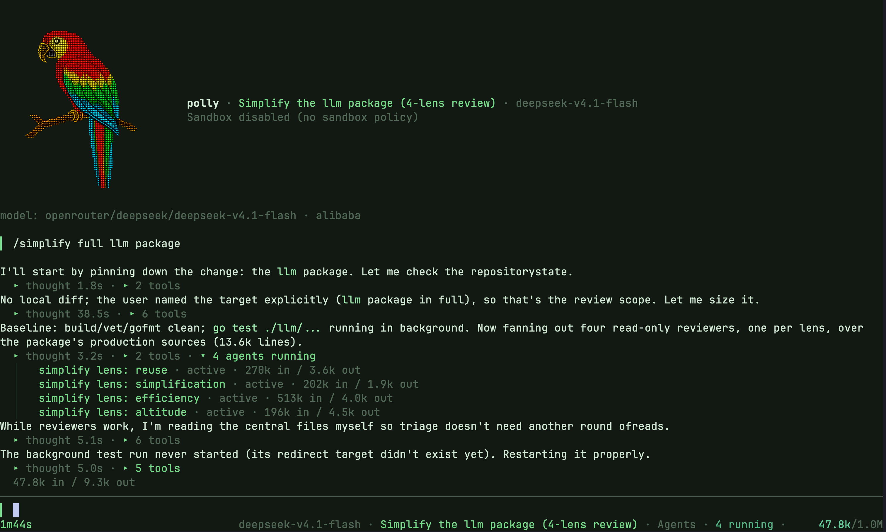

# Pollytool (polly)


My [LLM](https://en.wikipedia.org/wiki/Stochastic_parrot) harness.
There are many like it. This one is mine.

This file: the CLI and the TUI. [API.md](API.md): the Go library.
[SANDBOX.md](SANDBOX.md): the sandbox.



## Install

```bash
go build -o polly ./cmd/polly/
```

## Quick start

```bash
export POLLYTOOL_ANTHROPICKEY=...
export POLLYTOOL_OPENAIKEY=...

polly                                   # TUI
echo "Hello?" | polly                   # one-shot, stdin
polly -p "Hello?"                       # one-shot, flag
polly -m openai/gpt-5.4 -p "Quantum computing in one breath"

polly -f image.jpg -p "What's this?"    # files, images, URLs
polly -f notes.txt -f https://example.com/chart.png -p "Tie these together"

polly -p "uppercase this: hello" --tool ./uppercase.sh                                # shell tool
polly -p "create news.txt with today's news" --tool perp.json --tool filesystem.json  # MCP servers
```

Default model: `anthropic/claude-sonnet-4-6`. Override with `-m provider/model`
or `POLLYTOOL_MODEL`.

## TUI

No `-p`, no piped stdin: full-screen TUI. Streaming, scrollback, reverse
history search, bracketed paste.

No managed screen (`TERM=dumb`, redirected endpoints): line frontend.
Markdown with ANSI on a TTY. Raw text when redirected or `NO_COLOR` is set.

### Sessions

Every launch without `-c` gets a session with a generated name (`quiet-otter`).

- Resume: `polly -L` (last active), `polly -c quiet-otter`, or `/resume`.
- Keep: `/rename`. Named sessions never expire. Generated ones expire after 7 idle days.
- A session with no turns is discarded on exit.
- Status row: model and context use. `ctx 41.2k/156k`. A leading `~` means local estimate.

### Tabs

One polly, many sessions. Each is a tab.

| Command | Effect |
|---|---|
| `/resume` | Open a saved session in a new tab. The previous tab stays open. Clicking the session name in the status row does the same. |
| `/new` | New tab, fresh generated session |
| `/tab` | List tabs and what each is doing |
| `/tab <n>`, `/tab <name>` | Switch |
| `/parent` | Return to this agent’s parent session, reopening it if needed. Also available as `← Back to caller` in the divider above the composer. |
| `/close` | Close the visible tab. Session stays saved. A generated session with no turns is discarded. Last tab closed: polly exits. |
| `Alt+1`..`Alt+9` | Jump to a tab by position |
| `Alt+]`, `Alt+[` | Next tab, previous tab |

Rules:

- Settings are per tab. `/set` and `/model` touch only the visible one.
- Turns keep running in hidden tabs. Start a long run, switch away, keep working. Input queued behind a hidden turn runs when it settles.
- A hidden tab that finishes or fails posts a one-line notice in the visible transcript, once the visible tab is idle.
- A hidden tab that needs tool approval says so at once. The approval waits until you switch to it.
- Closing a tab mid-turn is refused. Esc first.
- Quitting with turns running elsewhere warns once. A second Ctrl-C cancels them, waits briefly for completed work to save, exits.
- Open sessions are leased. The picker marks sessions held by another polly `in use` and will not open them. Picking a session already open here jumps to its tab.

### Subagents

The model delegates with the `spawn_agent` tool. Arguments: a brief, an
optional label, the tools the child may use.

The child:

- runs in its own session on the same store, with a fresh context window
- inherits the parent's settings (the brief may set a model or iteration cap), active skills, and tools minus `spawn_agent`
- shares the parent's MCP servers instead of starting them again
- shares the working directory and files; give editing agents non-overlapping files and inspect their changes
- returns only its final reply, followed by its session name. `polly -c <name>` or `/resume` opens the full transcript
- asks for tool approval like the parent does, under `--confirm`
- counts its own tokens, reported with its reply, not added to the parent's turn

Several calls in one turn run in parallel, up to 32 at a time per parent session. Canceling a
blocking call stops waiting; its child retains a slot until it finishes.

`/resume` and `--list` nest agents under the session that spawned them,
named by label. The picker collapses them to a count. `→` on the parent
expands, `←` collapses. A typed filter finds them either way.
`--list --flat`: one line per session, for scripts.

**Background.** `background: true` returns at once. The reply arrives
later as a message to the parent and starts a parent turn when the parent
is idle. Replies landing while the parent is busy arrive together as one
message. The reply is addressed to the session, not a tab or a process.
The store holds it until the parent saves it as conversation input. Closed tab, quit polly, no
matter: it lands the next time the parent is open and idle, in any polly.
A child cut off by quitting reports as canceled with what it had said so
far.

**In the TUI.** Every child gets a tab, nested under its parent in `/tab`.
An ordinary tab: switch to it to watch it stream, type to send a
follow-up, Esc to cancel just that child. Approval and completion notices
work as for any hidden tab. Model `spawn_agent` calls appear under **Agents**
beside Thought, Tools, and Images viewed, including failed or denied launches.
Agents expands independently and lists tasks in launch order; click a task
label to switch to its child tab or reopen its saved conversation. The row
tracks the initial delegated run, including background work after the parent
turn finishes. Later follow-ups in the child leave that outcome unchanged.
Completed turns collapse the activity controls; while children are still
working, their turn's Agents label counts them (`1 agent running, 2 completed`);
failed, denied, and canceled launches stay counted (`3 agents, 1 failed`).
Saved history restores child links and known outcomes; older records with no
reliable outcome show `unknown`. `/spawn` keeps its existing presentation.
After its initial report is delivered, an agent tab closes when hidden, including
failed or canceled runs. If you are reading it, it stays until you leave.
Reopened agent sessions also close when you leave; drafts and follow-up
conversations keep their tabs open. The session stays saved and can be reopened
from Agents. Click `← Back to caller` in the divider above the composer,
or use `/parent`, to return to the parent (reopening it if needed).
Closing a tab
with running agents is refused. They work on a view of its tools.
`/spawn <brief>` starts a background child of the visible tab by hand.

One-shot and line mode: the tool always waits for the reply.

### Keys

| Key | Action |
|---|---|
| `Ctrl-C` / `Esc` | Interrupt the turn. `Ctrl-C` again, or at an idle prompt: quit |
| `Ctrl-R` | Reverse history search |
| `Ctrl-O` | Toggle the reasoning disclosure |
| `Ctrl-V` | Attach an image from the clipboard |
| `Ctrl-Z` | Suspend. `fg` resumes |

Input submitted mid-turn is queued and marked `(queued)`. Failed or
canceled input returns to the composer as a draft.

Mouse reporting is on, for scrolling and image clicks. Select text with
the terminal's override, usually Shift-drag.

### Slash commands

```
/help [command]              Show help
/attach <image-path>         Attach a local image to the next prompt
/clear                       Clear the display (history kept)
/context  (/stats)           Show transcript size and model budget
/get <key|all>               Inspect current settings
/set <key> <value>           Change a setting for this session
                             (model, temp, maxtokens, maxcontext, thinking, tooltimeout)
/model                       Pick a provider and model
/keys                        Set masked, process-local provider keys
/resume                      Open a saved session in a new tab
/new                         Open a new tab on a fresh session
/tab [n|name]  (/tabs)       List open tabs, or switch to one
/close                       Close the visible tab (session stays saved)
/parent                      Return to this agent’s parent session
/spawn <brief>               Start a background agent that reports back here
/tools [list [ns]|show <n>]  List or inspect loaded tools
/skills                      List discovered Agent Skills
/rename <name>               Rename the current context
/reset confirm               Clear durable conversation history
/exit  (/quit)               Leave the TUI
```

Keys set with `/keys` live until polly exits. Never written to the
transcript, history, database, or environment.

### Tool calls and reasoning

Tool activity: one collapsed `▸ N tool calls` row per turn. Click it for
timers, outcomes, and tool-produced images, updating in place. Details
show call labels and outcomes, never raw result bodies. The model still
gets every result. Durable history keeps the full exchange.

`--thinking`: reasoning shows as a collapsed `▸ thought 2.1s` row whose
elapsed timer ticks up live while thinking. Click it, or
`Ctrl-O`, for a live tail.

Both collapse when the turn ends. Both reopen later, even after a reload.

### Interrupted turns

A failed or canceled turn keeps everything it finished. Each completed
model iteration and tool result is written to durable history. A retry
continues from real state. Lost: only the text streamed by the
interrupted final call.

Labels: `failed · completed work saved`, `canceled · …`, or `not saved`
when nothing durable was produced.

### Images

**In.** Assistant Markdown with ``, or a tool result
with a local image path alone on a line: thumbnail. Relative paths
resolve from polly's working directory. Remote images, and paths inside
prose, JSON, or code blocks: not opened.

Kitty graphics on Kitty, Ghostty, WezTerm. Sixel on Windows Terminal
1.22+ and foot. Everything else, tmux and Zellij included: caption and
path. Override with `POLLYTOOL_IMAGE_PROTOCOL=kitty|sixel|none`.

**Out.** A local image path in the prompt attaches on submit.
`describe .assets/polly.png` works. `Ctrl-V` takes the clipboard image.
Drag-and-drop attaches a file. `/attach <path>` handles paths with
spaces. Each attachment is an `[image #N]` token at the cursor. Delete
the token, drop the attachment. Bytes are captured on submit, so later
changes to the file do not touch queued turns.

**Limits.** 16 images per prompt, 100 per request. 10 MB per image,
16 MiB per request. Downscaled to 1568px on the long edge. PNG, JPEG,
WebP pass through. GIF (first frame) and BMP become PNG. This is the
portable intersection of the
[OpenAI](https://developers.openai.com/api/docs/guides/images-vision),
[Anthropic](https://platform.claude.com/docs/en/build-with-claude/vision),
and [Gemini](https://ai.google.dev/gemini-api/docs/image-understanding)
image inputs.

## Contexts

A context is a named, persistent conversation. One-shot runs are
stateless without `-c`.

```bash
polly --create project --model openai/gpt-5.6    # create with settings
polly --show project                             # show its configuration
polly -c project -p "What database should I use?"  # continue
polly -c project                                 # continue in the TUI
polly --last -p "Explain the query"              # -L / --last: most recent context
cat notes.txt | polly -c project --add           # add stdin, no API call
polly --reset project                            # clear history, keep settings
polly --list                                     # list all, agents nested under parents
polly --list --flat                              # one line per context, for scripts
polly --delete project                           # delete one
polly --purge                                    # delete all (asks first)
```

Settings used with a context (model, temperature, system prompt, tools)
are saved to it and restored next run. Flags win over stored settings,
and the change sticks. A new system prompt on a context with history
resets the conversation. The stored system prompt holds only your custom
persona. With no custom persona, Polly adds a coding policy: respect the
requested scope, inspect before editing, preserve unrelated work, sequence
dependent changes, and verify the result. Display and conversation-recall
guidance is added per request as well. These defaults are never stored in
the transcript. The Go library does not add the CLI's coding policy.

Default coding turns also load `AGENTS.md` from the nearest Git root through
the working directory, in that order. A `.git` directory or worktree file
marks the root; outside a Git repository, only the working directory's file
is loaded. Instructions apply to their directory and descendants, with
more specific instructions taking precedence. The agent is told to check
for additional instructions before working in deeper directories. Files
are read again each turn under the sandbox read policy. A file that is
unreadable, non-text, or oversized is skipped with a warning, shown once
until the problem changes. Limits are 32 KiB per file and 64 KiB combined.

A non-empty `--system` / `POLLYTOOL_SYSTEM` replaces the coding policy and
automatic `AGENTS.md` loading. Display and recall guidance still applies.
`--schema` runs omit all of these CLI additions so the schema controls the
response. Explicit user requests take precedence over the coding defaults
and repository guidance.

Storage: one SQLite file, `~/.pollytool/polly.db`. Old JSON under
`~/.pollytool/contexts` is ignored. Backup: quit and copy the file, or use
SQLite's [online backup API](https://www.sqlite.org/backup.html) while it
runs. A plain copy of a live database can miss the write-ahead log.

## Models

Models are named `provider/model`.

| Provider | Example model | API key |
|---|---|---|
| OpenAI | `openai/gpt-5.4` | `POLLYTOOL_OPENAIKEY` |
| Anthropic | `anthropic/claude-sonnet-4-6` | `POLLYTOOL_ANTHROPICKEY` |
| Gemini | `gemini/gemini-3.1-pro-preview` | `POLLYTOOL_GEMINIKEY` |
| DeepSeek | `deepseek/deepseek-v4-pro` | `POLLYTOOL_DEEPSEEKKEY` |
| OpenRouter | `openrouter/anthropic/claude-sonnet-4-5` | `POLLYTOOL_OPENROUTERKEY` |
| Ollama | `ollama/gpt-oss` | `POLLYTOOL_OLLAMAKEY` (optional) |
| Hugging Face | `huggingface/...` | `POLLYTOOL_HUGGINGFACEKEY` |

`--baseurl`: a remote Ollama, or any OpenAI-compatible endpoint.

```bash
polly --baseurl http://192.168.1.100:11434 -m ollama/gpt-oss -p "Hello"
polly --baseurl https://api.openrouter.ai/api/v1 -m openai/whatevermodel -p "Hello"
```

- Native OpenAI: Responses API. With `--baseurl`: Chat Completions. Strict tool schemas with optional parameters go non-strict there.
- DeepSeek reasoning models need `reasoning_content` echoed on follow-up turns. Polly does it.
- OpenRouter: the upstream slug after the prefix. `openrouter/openai/gpt-5`.
- Ollama: schema support depends on the model.

## Tools

`-t`/`--tool`, repeatable. Detected by file type:

- `*.sh`: shell script, one tool
- `*.json`: MCP server config, one or more tools
- bare name: built-in (`bash`, `read_file`, ...)

Names are namespaced: `uppercase__to_uppercase`, `filesystem__read_file`.
`--confirm` asks before each call.

New contexts start with `bash` and every built-in file tool. Any `--tool`
replaces that default.

### Built-in tools

- `bash`: sandboxed shell.
- `read_file`: paged numbered lines, search, raw byte windows.
- `write_file`: create or replace a file. Makes parent directories.
- `edit_file`: replace an exact literal string. Must be unique, or pass `replace_all`.
- `list_dir`: one directory, non-recursive.
- `spawn_agent`: delegate to a child agent. See [Subagents](#subagents).
- `search_files`: `path:line: text` matches. Literal, or RE2 with `regex`. Filter with an `include` glob. Skips `.git`, symlinks, binaries, read-denied paths.

All enforce the sandbox policy in-process
([details](SANDBOX.md#what-gets-sandboxed)).

Conversations also provide recall tools for content omitted from model context:

- `list_artifacts`: catalog stored outputs and images from this conversation.
- `read_artifact`: read or search a stored output, or attach a stored image.
- `read_transcript`: read or search the conversation transcript.

Both readers accept `offset`/`limit` for numbered lines and `query` for literal
search. Use `byte_offset` on its own to continue through a long text line when
a page reports a byte continuation.

### Shell tools

Any executable is a tool if it answers two flags:

- `--schema`: print a JSON Schema
- `--execute <json-args>`: do the work, print the result to stdout, exit 0

```bash
#!/bin/bash
# uppercase.sh
if [ "$1" = "--schema" ]; then
  cat <<SCHEMA
{
  "title": "uppercase",
  "description": "Convert text to uppercase",
  "type": "object",
  "properties": {
    "text": {"type": "string", "description": "Text to convert"}
  },
  "required": ["text"]
}
SCHEMA
elif [ "$1" = "--execute" ]; then
  echo "$2" | jq -r .text | tr '[:lower:]' '[:upper:]'
fi
```

```bash
chmod +x uppercase.sh
polly -t ./uppercase.sh -p "Convert 'hello world' to uppercase"
```

A top-level `"sandbox"` field in the schema customizes the tool's policy.
See [Sandboxing](#sandboxing).

### MCP servers

Claude Desktop-format JSON. `-t mcp.json` loads every server in the file.
`-t mcp.json#filesystem` loads one.

```json
{
  "mcpServers": {
    "filesystem": {
      "command": "npx",
      "args": ["-y", "@modelcontextprotocol/server-filesystem", "/home/user/workspace"]
    },
    "remote-api": {
      "transport": "sse",
      "url": "https://api.example.com/mcp",
      "headers": { "Authorization": "Bearer ..." },
      "timeout": "60s"
    }
  }
}
```

Stdio servers run sandboxed like any other tool and may carry their own
`"sandbox"` overrides. Remote servers (`sse` or streamable HTTP) run
elsewhere.

## Skills

[Agent Skills](https://agentskills.io/specification): a folder per skill,
a `SKILL.md` manifest, discovered from one or more directories.

```bash
polly --listskills                          # default: ~/.pollytool/skills
polly --skilldir ~/.pollytool/skills --skilldir ./skills --listskills
polly -S ./my-skill -p "..."                # load one directly (dir, git URL,
                                            # or archive URL); auto-activated
polly --noskills -p "summarize this file"   # skills off for a run
```

Discovered skills are advertised in the system prompt beside the
`activate_skill` and `read_skill_file` tools. Activation loads the
skill's `scripts/` as shell tools and its `mcp/` configs as MCP servers,
namespaced by skill name. Its `allowed-tools` globs apply on later turns,
additively across activations.

## Structured output

A JSON schema in, validated JSON out. Images too:
`polly -f receipt.jpg --schema receipt.schema.json`.

```bash
cat > person.schema.json << 'EOF'
{
  "type": "object",
  "properties": {
    "name": {"type": "string"},
    "age": {"type": "integer"},
    "email": {"type": "string"}
  },
  "required": ["name", "age"]
}
EOF

echo "John Doe is 30 years old, email: john@example.com" | \
  polly --schema person.schema.json
# {"name": "John Doe", "age": 30, "email": "john@example.com"}
```

## Sandboxing

Tool commands (the builtin `bash` tool, shell tools, stdio MCP servers)
run **sandboxed by default**.

- Filesystem read-only outside the policy's writable paths.
- Credential paths hidden: `~/.ssh`, `~/.aws`, `~/.gnupg`, ...
- Credential-shaped environment stripped: `POLLYTOOL_*`, `AWS_*`, `*_API_KEY`, `*_TOKEN`, `SSH_AUTH_SOCK`, ...

`--sandbox <preset>` (`POLLYTOOL_SANDBOX`) picks the base policy. Join
components with `+`.

| Preset | Meaning |
|---|---|
| `base` | temp-dir writes only, no network |
| `readonly` | no writes at all, not even temp; no network |
| `workspace` | working directory writable; Git metadata read-only |
| `git` | with `workspace`: keep `.git` writable, pin only its dangerous leaves (config, hooks, routing pointers) so commit/rebase/fetch work |
| `net` | outbound network allowed |
| `ssh` | agent-based SSH: `SSH_AUTH_SOCK` and its socket pass through, `~/.ssh/config` and `known_hosts` readable; private keys stay masked |
| `sshkeys` | read all of `~/.ssh` including private keys; still not writable |

Default: **`workspace+net+git`**. Tighten with `--sandbox base` or
`--sandbox readonly` when tools only compute or inspect.

On top of any preset: `--writepath <dir>` and `--denypath <path>` (both
repeatable), `--allownet`. `--nosandbox` turns sandboxing off.

Per tool: a `"sandbox"` field in the shell tool schema or MCP server
entry widens or tightens that tool's policy.

**[SANDBOX.md](SANDBOX.md)**: every `"sandbox"` field, the merge rules,
Git metadata protection, platform details, limitations.

## CLI reference

```
NAME:
   polly - Chat with LLMs using various providers

USAGE:
   polly [global options] [command [command options]]

COMMANDS:
   embed    Generate embedding vectors for text input
   help, h  Shows a list of commands or help for one command

GLOBAL OPTIONS:
   --model string, -m string                                Model to use (provider/model format) (default: "anthropic/claude-sonnet-4-6") [$POLLYTOOL_MODEL]
   --temp float                                             Temperature for sampling (default: 1) [$POLLYTOOL_TEMP]
   --maxtokens int                                          Maximum tokens to generate (default: 64000) [$POLLYTOOL_MAXTOKENS]
   --maxiterations int                                      Maximum agent iterations (LLM calls) before stopping (default: 250) [$POLLYTOOL_MAXITERATIONS]
   --timeout duration                                       Stream stall timeout: cancel a request after this long with no provider data (0 disables) (default: 30m0s) [$POLLYTOOL_TIMEOUT]
   --deadline duration                                      Hard per-request ceiling: cancel a request after this total time even if data is still arriving (0 = no ceiling) (default: 2h0m0s) [$POLLYTOOL_DEADLINE]
   --thinking string                                        Reasoning effort: off, dynamic, a level (minimal, low, medium, high, xhigh, max), or a token budget (e.g. 12000) (default: "off") [$POLLYTOOL_THINKING]
   --baseurl string                                         Base URL for API (for OpenAI-compatible endpoints or Ollama) [$POLLYTOOL_BASEURL]
   --skilldir string [ --skilldir string ]                  Skill directory or directory containing skill folders (can be specified multiple times) [$POLLYTOOL_SKILLDIR]
   --skill string, -S string [ --skill string, -S string ]  Skill to load: local directory, git repo URL, or archive URL. Auto-activated on start.
   --noskills                                               Disable Agent Skill discovery and runtime skill tools
   --listskills                                             List discovered Agent Skills
   --tool string, -t string [ --tool string, -t string ]    Tool provider: shell script (provides 1 tool) or MCP server (can provide multiple tools). Can be specified multiple times
   --tooltimeout duration                                   Timeout for tool execution (default: 5m0s) [$POLLYTOOL_TOOLTIMEOUT]
   --prompt string, -p string                               Initial prompt (reads from stdin if not provided; starts REPL when neither is provided)
   --system string, -s string                               Custom persona (replaces coding defaults and AGENTS.md loading; display and recall guidance is added automatically) [$POLLYTOOL_SYSTEM]
   --file string, -f string [ --file string, -f string ]    File, image, or URL to include (can be specified multiple times)
   --schema string                                          Path to JSON schema file for structured output
   --context string, -c string                              Context name for conversation continuity [$POLLYTOOL_CONTEXT]
   --last, -L                                               Use the last active context
   --flat                                                   With --list, print one line per context instead of nesting agents under the context that spawned them
   --maxcontext int                                         Maximum estimated tokens sent to the model, clamped to the model's advertised context window when discoverable; full history is retained (0 = unlimited, never clamped) (default: 256000)
   --confirm                                                Require confirmation before each tool call (default: false)
   --sandbox string                                         Sandbox preset: base, readonly, workspace, git, net, ssh, sshkeys — join with + (e.g. workspace+net+git+ssh); git requires workspace (default: "workspace+net+git") [$POLLYTOOL_SANDBOX]
   --nosandbox                                              Disable sandboxing of tool commands [$POLLYTOOL_NOSANDBOX]
   --denypath string [ --denypath string ]                  Additional path blocked from sandboxed reads (repeatable, supports ~) [$POLLYTOOL_DENYPATHS]
   --writepath string [ --writepath string ]                Additional path sandboxed tools may write to (repeatable, supports ~) [$POLLYTOOL_WRITEPATHS]
   --allownet                                               Allow sandboxed tools outbound network access [$POLLYTOOL_ALLOWNET]
   --quiet                                                  Suppress status and tool display output
   --debug, -d                                              Enable debug logging
   --meta                                                   Emit a machine-readable run-outcome trailer (polly-meta key=value lines) to stderr
   --help, -h                                               show help
   --reset string                                           Reset the specified context (clear conversation history, keep settings)
   --purge                                                  Delete all sessions (requires confirmation)
   --create string                                          Create a new context with specified name and configuration
   --show string                                            Show configuration for the specified context
   --list                                                   List all available context IDs
   --delete string                                          Delete the specified context
   --add                                                    Add stdin content to context without making an API call
```

## See also

- [Soulshack](https://github.com/pkdindustries/soulshack): an IRC chatbot that uses Polly for LLM features.

## License

MIT
