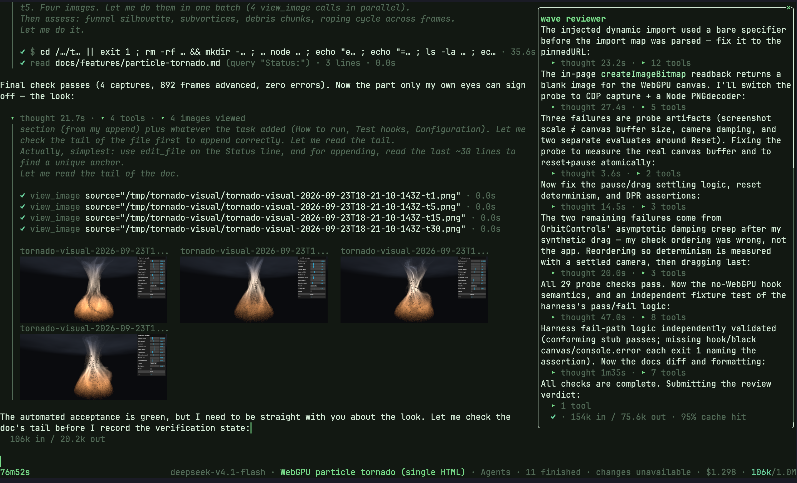
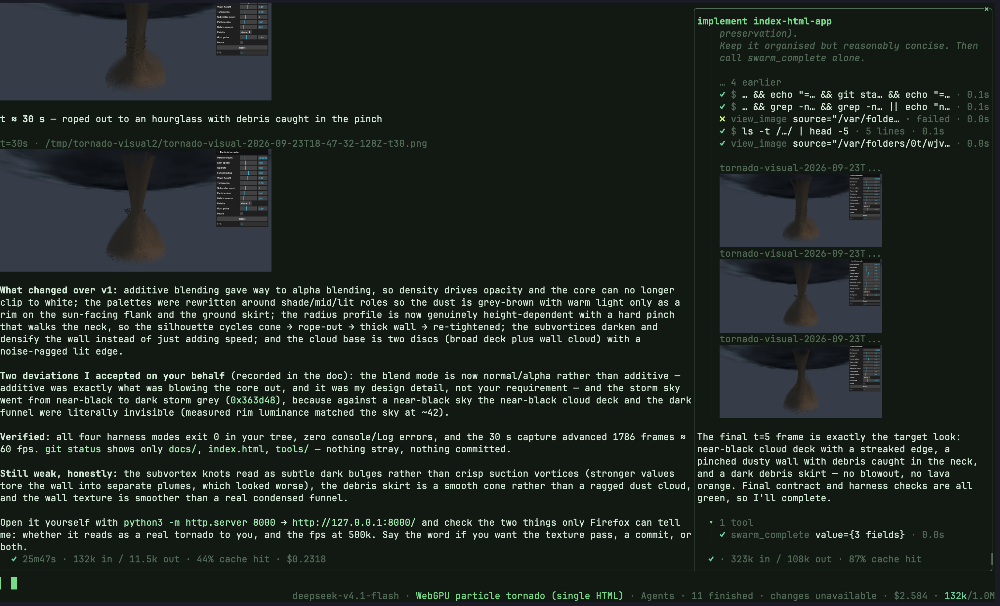
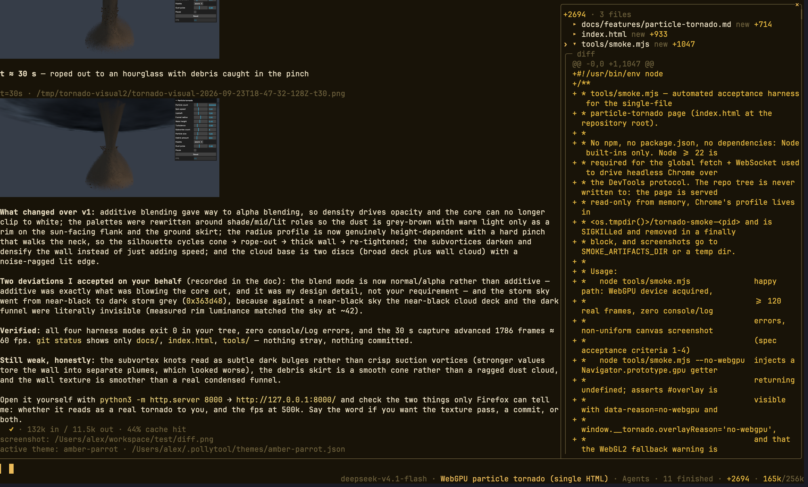
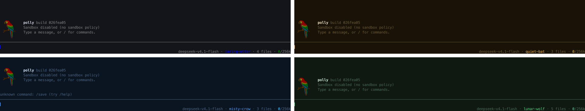

# Pollytool (polly)

My [LLM](https://en.wikipedia.org/wiki/Stochastic_parrot) harness.
There are many like it. This one is mine.

Polly is a terminal assistant with tools, saved conversations, and subagents.
Run it as a full-screen TUI, pipe it a prompt, or embed it in your own Go program.

<p>
  
  
</p>

## Contents

- [Install](#install)
- [Quick start](#quick-start)
- [One-shot output](#one-shot-output)
- [TUI](#tui)
- [Sessions](#sessions)
- [Models](#models)
- [Tools](#tools)
- [Skills](#skills)
- [Themes](#themes)
- [Sandboxing](#sandboxing)
- [Documentation](#documentation)

## Install

Polly builds from source with Go 1.27 or later, and it needs Git on your path.

```bash
go build -o polly ./cmd/polly/
```

Put the binary on your `PATH` (or run `./polly`) and start it from your project
directory.

## Quick start

```bash
polly                                      # open the TUI
polly -m openai/gpt-5.4 -p "Explain this repo"
echo "Hello?" | polly                       # prompt from stdin
git diff | polly ask "Explain this change"  # piped input with a prompt
polly -f image.jpg -p "What's in this image?"
```

The first launch walks you through setup: pick a provider, a model, and a key.
In the TUI that's a form; anywhere else it asks one question at a time. Come
back to it whenever you like with `/setup` or `polly --setup`, or skip the
questions by handing `polly --setup` the answers up front with `--model`,
`--effort`, `--theme`, and `--sandbox` or `--nosandbox`. The default model is
`anthropic/claude-opus-5`.

Keys come from the environment, such as `POLLYTOOL_ANTHROPICKEY`. A key typed
into `/setup` or `/keys` lasts only as long as the process, because Polly never
saves keys. Ollama and custom `--baseurl` endpoints can run without one.

A ChatGPT plan works without a key: `polly --login codex` (or `/login` in the
TUI) signs you in through your browser, keeps the sign-in in
`~/.pollytool/auth.json`, and unlocks the `codex/` models your plan includes.

Everything else can go in `~/.pollytool/config`. **Flags beat environment
variables, which beat the config file.** A saved session keeps its own settings
unless you pass a flag.

[Setup and configuration details →](docs/CLI.md#first-run)

## One-shot output

For a single turn, use `-p`, `polly ask "…"`, or pipe a prompt to stdin. Pipe
input and pass a prompt, and the input rides along with it. The answer lands on
stdout and live activity on stderr, so redirecting stdout gives you clean, raw
Markdown.

| Flag | Effect |
|---|---|
| `--stream` | Print text as it arrives |
| `--quiet` | Hide activity |
| `--activity-details` | Include thought, tool, agent, and image summaries |
| `--meta` | Emit a `polly-meta` record |

### Structured output

Pass `--schema person.schema.json` and stdout becomes validated JSON. Image
attachments work here too.

[Output details →](docs/CLI.md#one-shot-output)

## TUI

Run `polly` with no prompt and nothing piped in, and you get the full-screen
TUI. Under `TERM=dumb` or a redirect, Polly falls back to a simpler line
frontend.

Most of the screen is clickable. Click a tool, thought, or agent row to inspect
it. In the status bar, click the session name to switch sessions, the model to
change it, or the change count to see the workspace diff.



| Key | Action |
|---|---|
| `Enter` | Send; input during a turn queues for later |
| `Tab` | Accept a completion |
| `Ctrl-C` | Interrupt; again, or while idle, quit |
| `Esc` | Dismiss the popup or inspector; otherwise interrupt |
| `Ctrl-R` / `Ctrl-G` | Search history / pick a session |
| `Ctrl-O` | Expand or collapse inline details |
| `Ctrl-V` | Attach a clipboard image |
| `Alt+1`…`9` | Switch between open sessions |

Type `@` to attach a workspace file, or start a line with `/` for commands and
skills. Dragging a file into the composer attaches it, and Shift-drag selects
text.

A few commands worth knowing:

| Command | Action |
|---|---|
| `/help` | Browse commands |
| `/model`, `/keys`, `/setup` | Change the model, key, or defaults |
| `/new`, `/resume`, `/close` | Open, resume, or close a session |
| `/inspect` | Open the inspector |
| `/theme` | Preview and switch themes |
| `/sandbox-init` | Set up this project's sandbox |

### Subagents

Ask Polly to delegate, or do it yourself with
`/spawn [--read-only] [--review] <brief>`. Research agents come back with
findings. Editing agents work in isolated Git snapshots, and the parent
integrates their changes when they're done. Subagents need Git 2.40 or later.

Click **Agents** in the status bar to follow along or answer an approval
request, and run `/workflow SCRIPT.js INPUT.json` to drive agents from a
JavaScript workflow.

[TUI guide →](docs/CLI.md#tui) · [Swarms and workflows →](docs/WORKFLOWS.md)

## Sessions

TUI conversations save themselves. Unnamed sessions get a generated handle such
as `quiet-otter` and expire after seven idle days; give a session a name and it
never expires. One-shot runs leave nothing behind unless you pass `-c`.

```bash
polly -L                              # resume the last session
polly -c project                      # open a named session
polly -c project -p "Continue"         # continue it from the CLI
cat notes.txt | polly -c project --add # add context without a model call
```

`/title` sets a session's title and `/rename` changes its handle. Everything
lives in `~/.pollytool/polly.db`.

[Session settings and commands →](docs/CLI.md#sessions)

## Models

Pick a model with `-m provider/model`, `POLLYTOOL_MODEL`, or `/model`.

| Provider prefix | API key environment variable |
|---|---|
| `openai/` | `POLLYTOOL_OPENAIKEY` |
| `anthropic/` | `POLLYTOOL_ANTHROPICKEY` |
| `gemini/` | `POLLYTOOL_GEMINIKEY` |
| `qwencloud/` | `POLLYTOOL_QWENCLOUDKEY` |
| `deepseek/` | `POLLYTOOL_DEEPSEEKKEY` |
| `openrouter/` | `POLLYTOOL_OPENROUTERKEY` |
| `ollama/` | `POLLYTOOL_OLLAMAKEY` (optional) |
| `huggingface/` | `POLLYTOOL_HUGGINGFACEKEY` |
| `codex/` | none: sign in with a ChatGPT plan, `polly --login codex` |

The model picker completes the names it discovers, but you can always type one
in by hand. `--baseurl` points Polly at an OpenAI-compatible or Ollama endpoint.

Reasoning effort defaults to `high`; change it with `--effort` or `/set effort`.
Fast mode (`--fast`, `/fast on`) asks `openai/` models for priority processing
and `codex/` models for the backend's fast tier: quicker replies that cost
more, or draw more on a plan. Context limits are detected where possible, and
`/set maxcontext` adjusts them.

[Model discovery, routing, and limits →](docs/CLI.md#models)

## Tools

### Built-in tools

Out of the box, Polly can run Bash, read and edit files, delegate to agents,
view images, and recall earlier work:

| Purpose | Tools |
|---|---|
| Shell and files | `bash`, `read_file`, `write_file`, `edit_file`, `list_dir` |
| Agents and session | `spawn_agent`, `set_session_title` |
| Images and themes | `view_image`, `set_theme` (TUI only) |
| Recall | `list_artifacts`, `read_artifact`, `read_transcript` |

Add `--confirm` to approve each tool call yourself. To choose your own set, pass
`-t` / `--tool` once per tool; **any `--tool` replaces the defaults**.

### Shell tools

Any executable can be a tool. It just has to answer `--schema` with a JSON
Schema and `--execute <json-args>` with its result. Load it with
`-t ./uppercase.sh`.

[Shell tool example →](docs/CLI.md#shell-tools)

### MCP servers

Point `-t` at a Claude Desktop-format config to load its servers
(`-t mcp.json`), or pick out one (`-t mcp.json#filesystem`). Their tools show
up as `server__tool`. Stdio servers follow the session's sandbox policy; SSE and
streamable HTTP servers run on their own, outside it.

[Tool behavior and configuration →](docs/CLI.md#tools)

## Skills

A skill is a folder with a `SKILL.md` in it. Keep yours in
`~/.pollytool/skills` (or point `--skilldir` somewhere else), or load one on the
spot with `-S <dir|git|url>`. In the TUI, start a prompt with `/name` to
activate a skill.

Four skills ship with Polly:

| Skill | Use it for |
|---|---|
| `feature-workflow` | Plan, research, implement, and review a feature |
| `simplify` | Simplify changes without changing behavior |
| `theme-designer` | Create a theme with the colors you want |
| `sandbox-setup` | Prepare builds and tests through `/sandbox-init` |

A skill of your own with the same name shadows the built-in. `--listskills`
shows what's available, and `--noskills` turns skills off.

[Skill loading and activation →](docs/CLI.md#skills)

## Themes

`/theme` previews and switches themes, and `--theme <name>` picks one at launch.
The default follows your terminal's own palette, and four full themes ship
alongside it: `amber-parrot`, `azure-parrot`, `midnight-parrot`, and
`verdant-parrot`.



Your own themes go in `~/.pollytool/themes/`, and the TUI reloads the active one
as you edit it. Ask the `theme-designer` skill to make one, or write the JSON by
hand.

[Theme files, colors, and roles →](docs/CLI.md#themes)

## Sandboxing

**Sandboxing is opt-in.** Unless a flag, the environment, or the config file asks
for a sandbox policy, tool commands run unsandboxed.

```bash
polly --sandbox default                   # workspace + network + Git writes
polly --sandbox readonly                  # no writes or network
polly --sandbox default+private-home      # also hide ungranted home paths
```

Inside a sandbox, your ordinary home files stay readable, while known credential
paths and Polly's own storage stay masked. Writing to home takes a specific
grant, and adding `private-home` hides the rest of home as well.

`--add-dir ../shared` brings in another project directory, read-only under a
sandbox. In the TUI, `/sandbox-init` gets a project ready: it prepares isolated
build storage, runs the project's builds and tests, and records the commands
that worked in `AGENTS.md`. `/sandbox` shows the profile, and
`/sandbox try <command>` helps you work out why an operation was denied.

[Presets and everyday commands →](docs/SANDBOX.md#cli-presets) ·
[Policies and platform details →](docs/SANDBOX.md)

## Documentation

`polly --help` lists every flag, and most have a matching `POLLYTOOL_*`
environment variable.

[Documentation index →](docs/README.md)

| Guide | Covers |
|---|---|
| [CLI and TUI](docs/CLI.md) | Setup, commands, attachments, models, tools, and themes |
| [Swarms and workflows](docs/WORKFLOWS.md) | Delegation, review, integration, and JavaScript workflows |
| [Sandboxing](docs/SANDBOX.md) | Permissions, workspace profiles, and platform behavior |
| [Go API](docs/API.md) | Embed Polly in your own program |

## See also

[Soulshack](https://github.com/pkdindustries/soulshack): IRC chatbot built on Polly.

## License

MIT
