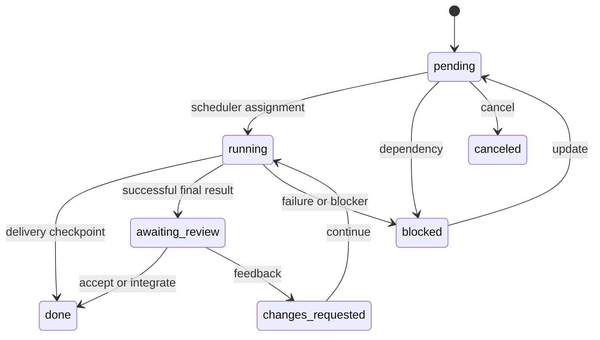
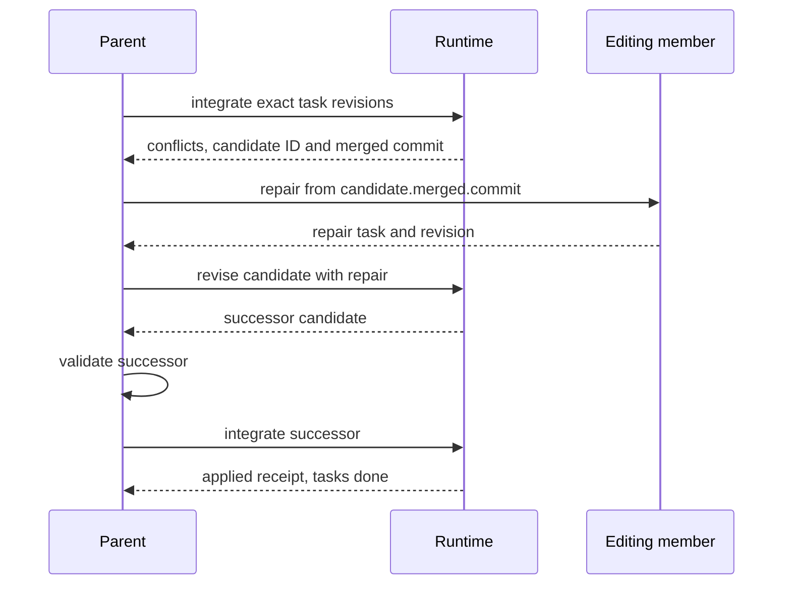
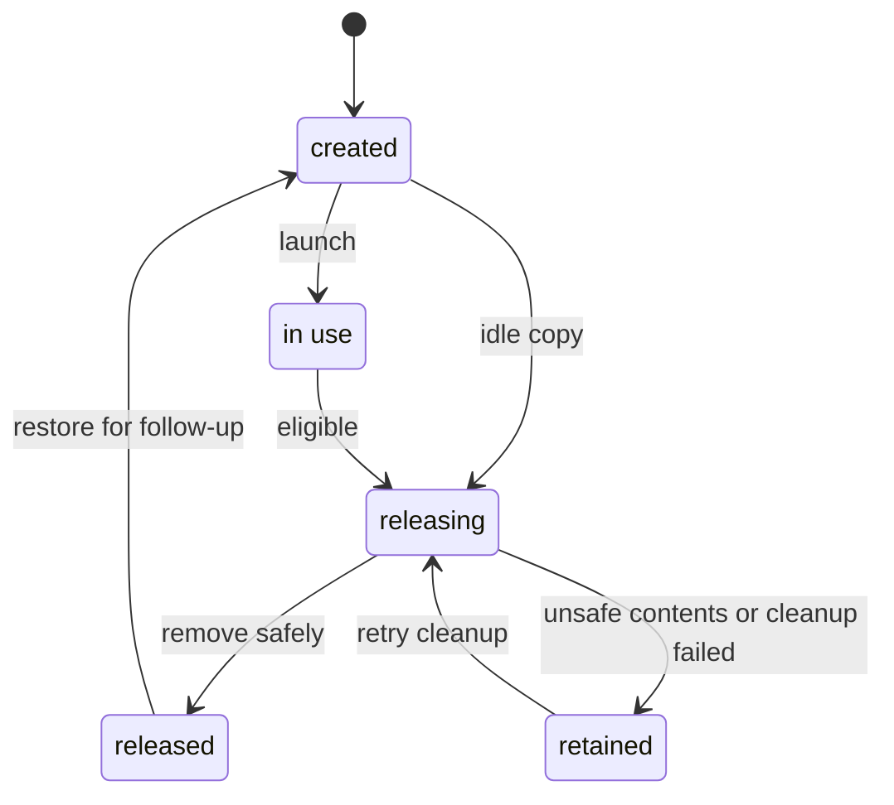

# Swarms and workflows

A parent and its direct children share one local swarm: tasks, mail, publications,
execution budgets, and isolated workspaces. Coordinate through model tools or an
optional JavaScript workflow over that same runtime. `/spawn` supplies a brief
directly; delegation through the model needs no script. Children do not start
nested swarms.

Before coordinating through model tools, read `swarm_help()` in a separate call.
It returns the coordination guide, including assignment, workspace, waiting,
review, integration, privacy, and budget rules. Before writing or changing a
workflow script, follow its pointer to `workflow_help()` for the JavaScript API
reference and runnable research and editing examples. Both guides ship inside
the binary and are available outside the Polly source checkout. Use delegation
for substantial work with useful independent assignments; ordinary tasks can
proceed directly.
Reuse each guide while it remains in conversation history and reload it when
needed. Both tools are parent-only, take no arguments, and return the same plain
text without reading session state or changing the system prompt or tool list.
Coordination tools remain available throughout; loading the guide is guidance,
not a runtime prerequisite. Children receive their own role instructions.

## Start, wait, decide

The parent's `/swarm` view and `swarm_read` lead with three buckets:

| Bucket | Meaning | Parent's next step |
| --- | --- | --- |
| Needs decision | Work needs acceptance, feedback, integration, failure handling, a reply, or a budget decision. | Use the item's `action`; `next` leads with the first decision. |
| Working | Executions or workflows are progressing, or results are being delivered. | Use `wait_agent`. |
| Done | The task's completion requirement is satisfied. | Use its result in the answer; start a follow-up if needed. |

Ordinary coordination is short. Managed `spawn_agent` requires an explicit boolean
`read_only`: true for research, false for editing. Omission or a non-boolean fails
before allocating work. Go, JavaScript and CLI defaults are unchanged.

| Work | Model calls |
| --- | --- |
| Research workflow | `workflow_run({source, input, background:true})` → `wait_agent` → answer |
| Direct research | `spawn_agent` with `task_name`, `message`, `read_only:true` → `wait_agent` → answer |
| Editing | `spawn_agent` with `task_name`, `message`, `read_only:false` → `wait_agent` → validate/integrate → answer |

Repeat the wait while work can progress. A decision interrupts this path with its
specific next action. Read-only work with explicit review adds `swarm_review`
before the answer. Integration may halt for repair or recovery.

`wait_agent({timeout_ms:30000})` returns `{message, timed_out}`. Read decisions and saved results with `swarm_read`; results also arrive through durable addressed delivery. A running workflow handles its internal progress and reports once when terminal. Directly delegated work and addressed mail wake the parent. Timeouts range from 10 seconds to one hour.

A member's parked wait releases its slot, registry and session lease after the tool batch commits. Addressed input, relevant task changes or timeout requeue the same execution with its remaining allowance. Its workspace remains. Model spawns always return immediately. The Go Spawn API retains its optional blocking/yielded behavior.

## Tasks, members, executions, and workspaces

| Object | What it keeps |
| --- | --- |
| Task | The assignment, completion requirement, revision, result, and evidence that the requirement was satisfied. |
| Member | A durable identity and conversation with fixed tool, model, and filesystem authority. |
| Execution | One logical turn, its generation, model-call allowance, outcome, and source provenance. Waiting and resuming retain that turn. |
| Workspace | A replaceable checkout and private scratch, or a read-only live root outside Git. Safe resources can be released after work settles. |

Finishing an execution captures a result. Finishing a task satisfies its declared
requirement. Releasing a workspace reclaims files and bindings; it preserves the
member and its results. A follow-up creates another task on that same member.

Every task fixes its requirement at creation:

| Requirement | Assignment | Completion evidence |
| --- | --- | --- |
| `delivered` | Ordinary read-only work | The exact result reaches a durable parent input or workflow step checkpoint. |
| `reviewed` | Read-only work with `review:true` (`--review` for `/spawn`) | The parent accepts the exact submitted revision. |
| `applied` | Editing work | Confirmed integration, or acceptance of immutable proof that the submitted tree is unchanged. |

A negative finding is a valid delivered result; delivery certifies receipt, not a
clean verdict. A failed execution leaves unresolved work. Ordinary research ends
with its result, which the runtime captures automatically; no manual acceptance
is required.
Reviewed research and editing submissions await their respective parent action.

`polly.tasks.create` inside a workflow accepts a creation-only `requirement`.
An owner supplies the authority-compatible default; an unowned task defaults to `delivered`. Specify
`requirement:"applied"` for unowned editing work. Assignment and reassignment refuse
incompatible authority with `requirement_mismatch`. To change the obligation,
create a replacement task and explicitly update dependents.



These are persisted task status strings; the arrows show the usual paths, not
all parent updates. The parent can cancel any open task. `done` is task completion,
independent of workspace release.
An applied task can stay `awaiting_review` after its revision is accepted while
integration remains pending or conflicted. The parent controls review and task
updates; the scheduler assigns tasks and submits successful final results.
Owners report blockers with `swarm_block` using the exact task revision.
Dependencies require `done`; canceling a dependency blocks its dependents. Cycles,
cross-run dependencies, and stale mutations are refused.

## Delivery and shared findings

A completion notice names the exact task, revision, and execution. Results up to
16 KiB arrive inline; larger results arrive as a 2 KiB preview with a
`swarm_read({view:"tasks", id:task, section:"result"})` retrieval reference. Each parent input
boundary admits at most 16 messages and 64 KiB, leaving overflow queued.
The checkpoint saves the input and delivery receipt atomically.

Foreground `workflow_run` returns `{id, status, output, steps, next, error?}` in
its tool result. The checkpoint saves that result (or its full artifact reference)
and consumes its terminal notice atomically, avoiding a second copy in peer mail.
A background launch acknowledgment never consumes terminal output. Failed saves
leave the notice available for recovery; failed/interrupted results still require
explicit acknowledgment or deferral. Direct Go launches retain notice delivery
unless a bound parent persists the corresponding foreground tool result.

A workflow records delivery when it saves the exact completed `agent` or
`followup` step, before JavaScript receives the result. Failed steps are not
evidence. If an execution completed but its step receipt was lost, workflow
termination or recovery posts a replacement notice. A failed workflow report
identifies tasks already delivered to its script.

Until that checkpoint, delivered research stays `running`, displayed as
`idle · delivering`. The receipt records the channel, reference, exact revision,
execution, timestamp, and whether the result fit inline. A large-result receipt
does not claim that the parent read all its bytes. Inspector reads alone do not
record delivery.

Use `swarm_publish` only for findings or artifacts another worker needs during
ongoing work. Final results are delivered through task completion and need no
separate publication. Publications include attribution, optional sources/artifacts,
and an optional captured commit. Authors can supersede their own findings while retaining
history. `swarm_read({view:"publications", query})` searches explicit publications
across retained runs using case-insensitive literal matching. Shared text may describe a different commit:
verifiers should treat it as a lead and establish conclusions against their
assigned source. Private transcripts and unpublished artifacts are not searchable
through these tools. Use `read_artifact` with a published artifact ID to page or
search its text or attach its image, just as for a conversation artifact. Reading
another agent's artifact requires an explicit publication in the same family;
guessing a private artifact ID does not grant access.

`send_message({target, message})` delivers information at a safe input boundary. It never starts an idle worker. `followup_task({target, message})` explicitly steers an active worker or starts an idle one. Review feedback and Go request/reply messages no longer start idle workers. Authenticated authorship does not turn peer text into user instructions or enlarge authority. Admitted messages stay in saved model history.

Default `list_agents` entries contain member ID, canonical name, label, read-only mode, and compact lifecycle/task state. `details:true` adds workspace/task/execution IDs, budgets and full state; workspace release uses its `context` field. Filtering, pagination, and self/parent state remain available in both modes. Task summaries retain current revision and requirement; request `swarm_read({view:"tasks",id,section:"details"})` for delivery receipts, lineage and capture provenance.

Targets accept canonical `/root/<task_name>` names, relative sibling names or stable member IDs. `list_agents` includes idle workers even after workspace release. Names and human-readable session labels are independent of durable assignment IDs. `interrupt_agent({target})` cancels the current turn, preserving its worker, evidence and unresolved task; follow up explicitly to continue. Active workflow reservations remain enforced.

Historical Go request/reply records retain their settlement obligations. The current send_message tool answers the recipient's oldest outstanding addressed request if one exists. Reading does not clear it; Go Send still supports explicit reply IDs. New model messages are informational.

## Integrating editing results

Give `swarm_integrate` the exact editing task revisions:

```json
{"tasks":[{"task":"TASK_ID","revision":3}],"drift":"paths"}
```

The call accepts those revisions and integrates them under one exclusive gate and
task lock. Changed work becomes `done` only after confirmed application. An
unchanged submission completes from its immutable starting/submitted tree proof,
without an empty apply. A batch may contain both kinds.

Successful changed work returns `status:"applied"`, the candidate, task references,
and a durable receipt. Unchanged work returns `status:"done"` and `unchanged` IDs.
Use `{"candidate":"CANDIDATE_ID"}` to finish an existing candidate. Exactly one
selector is required; IDs must be unique and revisions positive. Candidates keep
their drift policy, so do not pass `drift` with `candidate`, even on a retry.

Public candidate objects always include `receipt`, including candidates returned
by prepare, read, revise, refresh, or a structured error. `candidate.receipt ===
null` means no apply attempt is recorded for that candidate. It does not prove
the parent's files are unchanged; verify their contents separately. A receipt's
`status` is `applied` (confirmed success), `not_applied` (reconciliation found the
patch unapplied), `applying` (an attempt began), or `recovery_required` (the outcome
needs inspection). Reconcile an uncertain attempt before deciding how to proceed.
Use `candidate.receipt` directly, without alternate property names or fallbacks.
`polly.integrate(...)` returns application evidence in `result.receipt`; unchanged
work may omit it because no application was needed.

| Halt | Next step |
| --- | --- |
| `conflicts` | Inspect the saved candidate, repair from its exact `merged.commit`, and `revise`; integrate the successor. |
| `parent_changed` | Explicitly `refresh` the ready candidate; validate again if `changed:true`, then integrate. |
| `recovery_required` | Use `workflow_run` with `polly.integration.reconcile(id)`; inspect the observed outcome before an explicit retry or recovery. |
| Stale revision or superseded candidate | Read the current task/candidate and select the intended exact revision or successor. |
| Wrong completion requirement | Deliver ordinary research, or accept reviewed research with `swarm_review`. |



A conflict retains accepted task revisions and one decision for the candidate;
unchanged inputs already completed stay done. Start a resolver in a parent
workflow with `polly.agent({label: "Review merged candidate", commit: candidate.merged.commit, task: brief})`.
The repair must be a distinct editing task based on that exact intermediate
commit. `revise` records it as a contribution and merges remaining inputs.
A further conflict may need another repair. `refresh` applies to a ready candidate;
it does not resolve a conflicted one. Changed successors supersede overlapping
candidates; an unchanged refresh retains the ID and acceptance.

For combined review and checks, use
[integrate-results.js](examples/workflows/integrate-results.js). It prepares the
candidate, handles bounded repairs, reviews and checks each changed candidate,
then calls `polly.integrate({candidate: candidate.id})`. Defaults are two repair
executions and one refresh per attempt. Supply check commands explicitly; an
empty list omits them. Reviewers receive task descriptions and acceptance criteria.
Each list entry is one required command. `polly.exec` checks the final shell exit
status: later commands can mask failures. Use separate awaited calls, propagate
compound failures explicitly, and enable `set -o pipefail` in validation pipelines.
Prefer portable `cmp`/`od`; distinguish grep's no-match exit 1 from execution errors.
Only ordinary command failures or negative verdicts enter the validation repair
loop; sandbox errors, cancellation, exhausted budgets, and uncertain applies halt.

For a runnable regression exercise, use
[integration-evidence-exercise.js](examples/workflows/integration-evidence-exercise.js)
in a disposable Git repository with a tracked `features.txt` containing exactly
`features=base` plus a newline. Pass `{"path":"features.txt"}`. Two workers make
conflicting edits; an intentionally incomplete repair fails an exact `cmp`
assertion. A second repair must produce a new commit that passes fresh review
and checks before the explicit integration call becomes reachable. The output
records both validation commits and the final receipt. This exercise changes
the fixture's working files; it preserves the parent's HEAD and index.

Each check gets its own writable copy of the immutable candidate. Check-side
changes are not automatically contributions. Adopt intended changes through an
editing repair, revise, and validate that successor. Successful attempts release
safe temporary copies and report dirty copies with context IDs and paths; failed
attempts retain copies for inspection.

The default `paths` drift policy protects changed paths, including rename endpoints,
existence, file type, mode, content, and real-directory ancestors. It checks ignored
existing destinations too. Unrelated parent edits survive, so the final checkout
can differ from the tested snapshot. `tree` additionally requires whole-parent-tree
equality. Application preserves the parent's branch, HEAD, and index.

After preflight crosses the write boundary, cancellation waits for a bounded apply
and receipt; it does not roll back files. Parent lease loss still fences writes.
The default apply timeout is two minutes (`--swarm-apply-timeout` /
`POLLYTOOL_SWARM_APPLY_TIMEOUT`), followed by a separate ten-second receipt bound.
On recovery, matching after-states confirm application, matching before-states
permit an explicit retry, and mixed states require recovery. No automatic patch
replay or rollback occurs.

An applied-candidate retry returns its original receipt, even after snapshots are
forgotten. An exact completed-unchanged retry is read-only but requires retained
immutable proof. A prepared unchanged candidate remains inspectable after completion
and does not block forgetting. New integration work waits for uncertain applies to
be reconciled; completed replays do not disturb unrelated uncertain applies.
Integration ends at working files. Staging, commits, and publishing require the
existing task's authorization. See the [advanced repair API](API.md#integration-reference)
for stepwise inspection and recovery operations.

Captured code uses full retained Git commit IDs in model tools and JavaScript: `commit: candidate.merged.commit`, detailed task `baseCommit`/`resultCommit`, and publication `commit`. Integration candidate IDs remain separate. The old `snapshot` argument is rejected; Go snapshot APIs and historical records retain their existing identifiers. See [interface migration](docs/swarm-interface.md#public-captured-code-references).

## Workspace release and restoration

Git members get isolated snapshots, including read-only researchers. Editing
requires Git 2.40+ and a supported process sandbox, or an explicit unsafe opt-out.
`source` chooses a checkout root in the same repository, not a package directory
or permission to work in the parent's checkout. Give repository-relative paths
in briefs. `HEAD` is a parentless snapshot; supply an original commit ID for history
inspection. Outside Git, read-only work uses its original live root. Git setup
failures never silently fall back to live files.

Each workspace has private scratch (`TMPDIR`, `TMP`, `TEMP`, `GOTMPDIR`, `GOCACHE`;
`GOPROXY=off`). Native tools, processes, MCP servers, instructions, and skills bind
to the assigned root. Source capture includes tracked edits and non-ignored new
files without changing the parent's index or HEAD. Git limitations, capture guards,
and authority rules are in [SANDBOX.md](SANDBOX.md#swarm-snapshot-limits).

Automatic release becomes eligible when all owned tasks are `done` or `canceled`,
no execution or tool is active or paused, no active workflow reserves the member,
and no uncertain apply involves its work. Deletion requires proof that the workspace
is unchanged from its base or exactly matches a completed editing task's captured
tree. Unexpected changes retain the workspace with a reason; release failure never
reopens a completed task.



This is a resource lifecycle. Only `releasing` and `retained` are persisted release
values; created/in-use records have an empty release field. Successful removal
deletes the context record and clears the member's context pointer. The runtime
marks `releasing` before deletion, closes bindings before removing files, and
rechecks interrupted releases on reopen.

Automatic release leaves active workflow reservations and workflow-owned check
copies alone. `polly.release(context)` explicitly releases an attempt's own idle
copies or settled member workspaces while preserving reservations and conversations.
Active tools, paused executions, open tasks, unintegrated edits, and uncertain
applies prevent release. Retained workspaces need inspection and an explicit retry.

`/swarm cleanup ID` or `/swarm cleanup all` removes safe inactive workspaces and
previews while preserving snapshots. It requires active members and workflows to
stop, then waits cancelably for any current automatic release pass. The TUI runs
cleanup and forget in the background and reports completion in the originating
workspace. Background release does not count as active agent work or prevent
closing a workspace; runtime shutdown still joins its worker. Cleanup of an already released member workspace
succeeds using its saved execution provenance.

Model `swarm_control` with `action:"release"` attempts only the named context and
returns `context` and `status`: `released`, `ineligible`, `retained`, or `busy`.
Unreleased outcomes include a `reason`; unexpected file or storage failures remain
errors. A repeated release of a known released member workspace reports `released`.
The default capacity is 512 workspace slots, including validation copies; explicit
release lets workflows reuse slots. Model calls default to 32 concurrent children.

## Follow-ups

Use `followup_task({target, message})` for ordinary continuation. Active work is steered within the same execution; interrupted work keeps its remaining iteration allowance. Changes requested or unaccepted submissions reopen the same task with a new revision. A settled assignment gets a linked new task. Review rejection records feedback and waits for explicit follow-up or reassignment.

An invocation finishing its terminal checkpoint can briefly return `session_busy`;
retry once it is idle so the receipt identifies the assignment that will do the work.

Default follow-ups preserve the worker's code. To give an idle worker current
parent code after its assignment is done, explicitly request refresh:

```js
followup_task({target: "parser_tests", message: "Check the implementation now present in the parent files.", refresh: true})
```

Refresh captures eligible committed, uncommitted and untracked parent files,
then replaces only that worker's safe workspace. Identity, conversation, role,
model, tools and completion requirements remain the same. Runtime guidance gives
both parent and worker the selected baseline; the worker is told it supersedes
earlier file descriptions. Parent edits after selection are not included.
Non-Git research retains its saved live root and source kind with fresh scratch.
Its files are already live, even if the parent later becomes a Git repository.

An active or paused execution, pending follow-up, open assignment, live workflow
reservation or uncertain integration prevents refresh. Retained workspaces and
additional worker edits are preserved with a refusal explaining the cause.
Resolve and release that workspace before a new request; a retained workspace
needs client `/swarm cleanup <context>` after its files are safe. Refresh neither accepts
old work nor grants budget; the new result needs its usual delivery, acceptance
or integration. `send_message` changes information only. Use a new worker for
independent review.

The tool returns `{member, message, operation, task, execution, baseOrigin,
baseCommit?, source?, note}`. `message` is the durable message ID; the assignment
text is not echoed. Operations are `steer`, `resume` and `new_task`. Baseline
origins are `parent`, `previous_result`, `original_baseline`,
`existing_workspace` and `live_source`. An existing workspace may contain edits
beyond its baseline. Unavailable commits and historical launch fields are omitted.

`refresh` is strictly boolean and defaults to false. The normalized arguments
participate in call-ID idempotency. A retry uses the original capture, assignment
and execution, even after later work; changed arguments under that ID are refused.
Interrupted preparation remains inert until an explicit retry. Recorded failures
disable startup intent; committed executions retain normal paused recovery.
Launch provenance is stored separately from completion/delivery evidence. Reading
it cannot acknowledge delivery or settle a task. Historical transcripts stay intact;
there is no database migration or workflow replay.

The advanced `polly.followup` API accepts a completed task ID and optional commit. It creates a linked task with the same member, conversation, requirement and authority, then launches it.
The original task and result remain unchanged. A missing workspace is recreated:

- Read-only follow-ups default to the original task's `baseCommit`.
- Editing follow-ups default to that task's completed `resultCommit`.
- An explicit retained `commit` refreshes only the new task.
- Non-Git research keeps its original absolute live root with fresh scratch; it
  cannot promise historical file contents.

A live workspace must match the chosen source too; editing files must equal the
selected commit's tree. A mismatch requests release and retry. Retained workspaces need
inspection. Missing, pruned, or forgotten provenance returns `workspace_unavailable`;
select a retained commit or start new work. Current parent code is never an implicit
substitute for a missing capture.

Inside a workflow's `run` function:

```js
const research = await polly.agent({label: "Inspect parser", task: "Inspect the parser", readOnly: true});
const detail = await polly.followup({
  task: research.task,
  question: "Explain the edge case against the same source",
});
return {answer: research.value, detail: detail.value};
```

For a submitted task needing changes, use `swarm_review` with feedback. A running
workflow retains its member reservation, so feedback does not wake that member;
the script continues it explicitly with `polly.agent({session, task: feedback})`.
Follow-up is for a completed task, not a replacement for unresolved review.

## Settlement and recovery

Both CLI and TUI keep the parent's answer provisional until coordination settles.
The harness admits delivery notices, acknowledges delivered successful workflow
outputs, and completes previously accepted unchanged work from retained proof.
Remaining review, dependency, budget, failure, reply, and integration obligations
produce a concrete next action. One corrective prompt is allowed for unchanged
unsettled state before a blocker is returned. Display folding cannot hide an
obligation from settlement.

Failed or interrupted workflow reports need inspection and `swarm_control({action:"acknowledge_workflow", id})`
(or `/swarm acknowledge-workflow ID`). This records handling, without accepting
tasks or discarding files. Completed reports are acknowledged when their output
notice reaches the parent checkpoint. Research already delivered to a script stays
done if a later step fails; reviewed research and editing work still need their
own completion evidence.

To set aside a failed attempt, `/swarm defer-workflow ID NOTE` explicitly records
its exact unresolved revisions and acknowledges the report. Deferral does not
accept, apply, or cancel work. A later change to the recorded task/execution facts
invalidates it. Recovering older work waits for a newer run to settle and keeps the
original budget accounting.

Parent leases and child execution generations fence scheduling and writes.
Checkpoints save output and mail receipts atomically. Uncertain tool intents get
interrupted receipts rather than automatic reexecution. Shutdown pauses unfinished
members and marks interrupted workflows. Reopen, inspect `/swarm`, and explicitly
resume the intended work. JavaScript has no persisted heap: restart a workflow by
submitting its source and input as a new attempt.

Logical starts default to 256 per run. `/swarm grant N` adds starts. `/swarm resume ID`
resumes a paused execution with its remaining model calls; `/swarm resume ID N`
grants N more calls to that same execution without spending a start. A completed
or failed execution resumed as a new turn spends another start. Active workflow
reservations must settle or be canceled before a host takes over a member.
Resuming an agent does not resume its JavaScript. A durably accepted structured
completion can finalize without another model call, even at the iteration limit.

One-shot memory sessions promote to `~/.pollytool/polly.db` before coordination
mutates shared state; library hosts must arrange durable storage for recovery.
Format 2 is independent of the SQLite schema. Roots with old/missing swarm formats
are refused without migration; their records and files remain for inspection, and
new delegated work uses a new root session.

Snapshot refs survive workspace release until `/swarm forget`, which first requires
safe cleanup and resolved integration obligations. Published bytes and SQLite
records follow parent retention. Parent deletion or TTL expiry does not clean Git
workspaces or refs. Forgetting snapshots removes the default restoration source
for later follow-ups.

One-shot stdout is settled by default; `--stream` permits immediate output.
When settlement reopens a provisional answer, piped stdout prints the answer
blocks in order with blank-line separation, without internal coordination prompts.
`--schema` keeps a single validated final document.

## Inspecting saved work

`/swarm` opens the decision list, then members, tasks, messages, publications,
workflows, integrations, previews, and raw records. Model-facing reads are bounded:

| Read | Select the needed evidence |
| --- | --- |
| `swarm_read` (default status) | `section:"decisions"` or `"working"` to page a list; totals include omitted pages. |
| `swarm_read({view:"tasks", id})` | `id` plus `section:"details"` for criteria/feedback or `"result"` for captured output. |
| `swarm_read({view:"workflows", id})` | Parent-only; `id` required for a summary; `section:"steps"` then `section:"step", step:ID`; or `source`, `input`, `output`. `pointer` selects nested JSON. |
| `list_agents({path_prefix?})` | All available workers, including idle or released ones; execution status and task state are separate. |
| `swarm_read({view:"messages", id?})` | List your inbox or select a complete addressed message. Reading never acknowledges delivery. |
| `swarm_read({view:"publications", query?})` | Literal case-insensitive publication search; pages include full findings and artifact references. |

Lists use 1-based `offset`, default limit 50, maximum 100, and a 16 KiB response
budget. Pass `next` back as `offset`. Large selections provide previews and complete
text artifacts; use the returned artifact reference for paging, literal search,
or exact byte offsets. Inspection reads captured evidence, never resumes JavaScript,
and never treats current workspace contents as a saved result. The full
[format-2 state model](docs/swarm-state-model.md) explains the underlying records.

## Running JavaScript workflows

```text
/workflow /absolute/path/workflow.js /absolute/path/input.json
/swarm workflows
/swarm cancel-workflow REPORT_ID
```

The slash command reads files. The `workflow_run` model tool requires
**JavaScript source text, never a file path**, plus JSON-encoded string input.
It waits by default; `background:true` returns a report ID and outlives the launching
call. Park with `wait_agent` until its terminal notice. Cancellation or runtime
shutdown stops the attempt. Both modes save source,
input, operation intents, results, failures, and output, and wait for active host
effects and their receipts before teardown. Read the report with `swarm_read({view:"workflows", id})`.

[fix-review-findings.js](examples/workflows/fix-review-findings.js) fixes in an
isolated copy, reviews the immutable result, runs checks in another copy, and
permits one repair followed by a fresh reviewer. Use
[input.json](examples/workflows/input.json) as a template and integrate the returned
exact editing task revisions. [doc-drift-audit.js](examples/workflows/doc-drift-audit.js)
enumerates claims, verifies each against code, optionally edits, then reverifies the
original claim set against the editor's snapshot. `repair:false` returns findings
only. Empty claims, missing evidence, and unverifiable findings fail closed;
these checks do not establish that a cited source is correct. Editors make no commits.
[code-review.js](examples/workflows/code-review.js) runs three independent reviewers
over each supplied diff, has one judge integrate their findings into canonical issues,
then one final reviewer that audits the judge's judgments, revising severities and
reporting what the judge dropped. The final reviewer receives the complete judgment
and original reviews, including checked evidence, disagreements, and unknowns, and
audits that context even when no issues were found. It is read-only: supply the diff
text, the intended behavior, and optionally a custom lens list, and it returns the
integrated issue list.

New agents require a short `label` (1–80 characters) describing their purpose.
The host saves it as the initial session title before the child runs, including
when tools are disabled. Continuations inherit the label and preserve the saved
title. Child agents do not receive `set_session_title`; manual F2 and `/title`
editing remain available.

Scripts define exactly one workflow:

```js
const s = polly.schema;
polly.defineWorkflow({
  name: "research",
  inputSchema: s.object({question: s.string()}),
  async run({question}) {
    const result = await polly.agent({
      label: "Research question", task: question, readOnly: true,
      schema: s.object({answer: s.string()}),
    });
    return result.value;
  },
});
```

The [JavaScript API reference](API.md#javascript-surface) lists every supported
operation. There are no direct Node.js, module, process, filesystem, network, or
timer APIs. All effects go through the trusted host and its inherited authority.
`polly.scope({context}, async work => ...)` supplies an isolated context to its
work methods; it does not grant parent integration authority or accept `cwd`.

Schemas validate input before host operations. Objects require declared keys and
reject extras by default. `keyed` requires the original ID set and rejects duplicate
IDs before dispatch. Typed tool-enabled agents finish with an exclusive
`swarm_complete({value})` call. Missing/invalid values receive at most two corrective
continuations within the same execution allowance, then fail with saved partial
work. Tool-free agents return validated JSON. A successful completion captures a
value; the task's requirement still determines delivery, review, or integration.

Await every host operation. `parallel` returns ordered results, defaults to
concurrency 8 and `errors:"collect"`, and bounds concurrency to 1–256.
`"throw_after_all"` waits for all branches before failing. Pending host operations
at return, or promises with no host operation capable of settling them, fail the
attempt. Output serialization cannot start host effects.

`exec(check:false)` recovers only an ordinary nonzero exit after the target process
starts. Approval denial, sandbox setup failure, timeout, and cancellation still
reject. OS denials inside an already running command remain that command's exit;
stderr text does not determine the error type.

The VM owns one goroutine; host work resolves promises there. Defaults are five
seconds per uninterrupted JS slice, 4,096 host calls per attempt, and a 512-frame
stack. Host waiting does not spend the slice budget. There is no hard heap quota,
and JavaScript limits are not an OS sandbox. Agent iteration limits come from the
host; scripts cannot set `maxIterations` or grant themselves more calls. Usage
missing from provider metadata is `null`, not zero.

## Advanced task workflows and tool compatibility

The fixed model surface has 14 parent tools and six child tools; typed children
add `swarm_complete`. See the [tool table and breaking changes](docs/swarm-interface.md).
Go task, submission, snapshot and integration methods remain available. No stored
records or transcripts are migrated, and interrupted scripts are never replayed.

Use `polly.tasks.create` and `polly.tasks.update` to manage dependencies and assign
work. Run precreated tasks with `polly.agent({taskID: task.id, label, task: brief,
readOnly: true})` after dependencies complete, selecting a role compatible with
the creation-time requirement. Assignment, final submission and snapshot capture
are automatic. An explicit `swarm_block` leaves the task unresolved.

[task-dependencies.js](examples/workflows/task-dependencies.js) creates dependent
research, requests changes, reassigns to a new member, and explicitly accepts
the replacement's reviewed result. Run with input
`{"question":"How does the cache work?","feedback":"Verify the failure paths independently."}`.

[reconcile-integration.js](examples/workflows/reconcile-integration.js) takes
`{"id":"candidate-or-apply-id"}` and observes an interrupted apply with
`polly.integration.reconcile(id)`, then reads the candidate/receipt. It never
reapplies a patch. Inspect `not_applied` or `recovery_required` before choosing
a separate explicit retry or repair. Both scripts are also in `workflow_help`.
