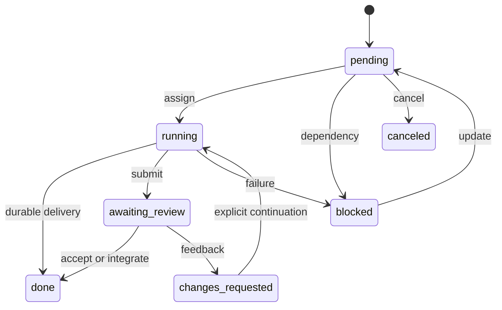
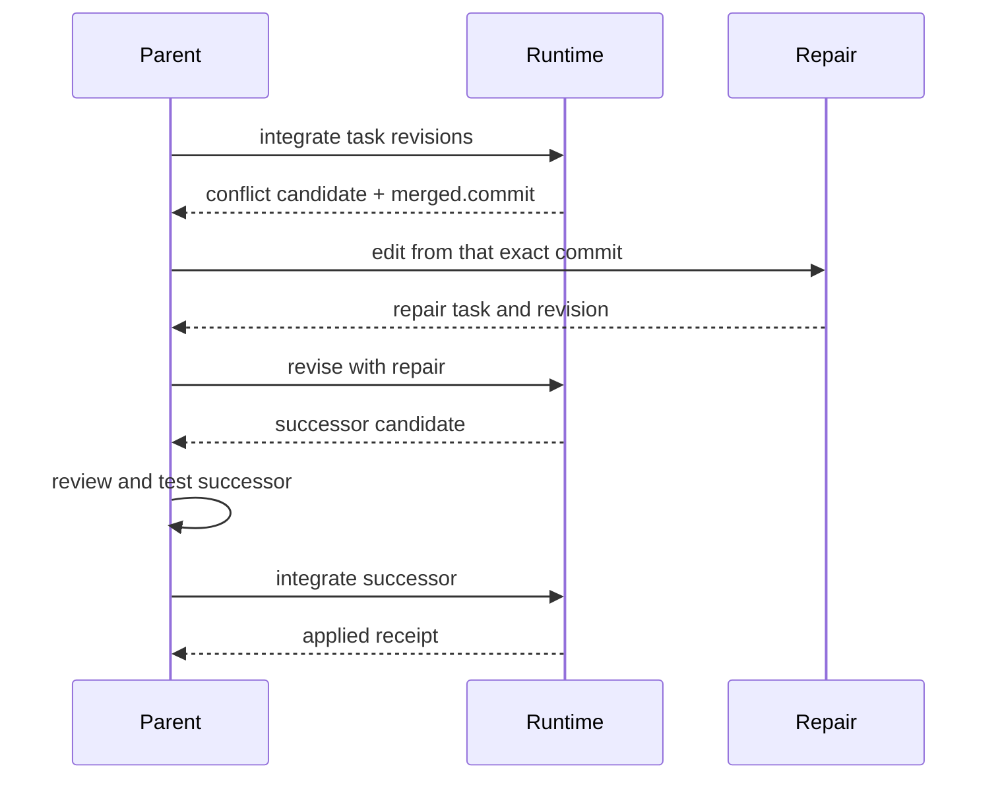
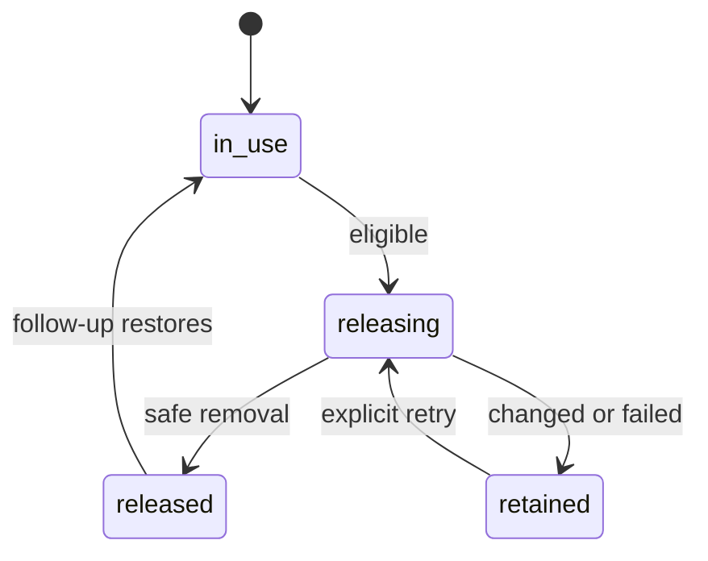

# Swarms and workflows

Delegate an independent assignment to an agent, or use JavaScript to coordinate
several assignments. Both use the same tasks, conversations, budgets, and isolated
workspaces. A parent and its direct children form one swarm; children do not
start nested swarms.

**Available now:** `/spawn`, `/workflow`, the Agents inspector, model tools, and
the Go runtime. **Currently disabled:** `/swarm` and all of its slash subcommands.
Examples below use the available interfaces.

## Contents

- [Start, wait, decide](#start-wait-decide)
- [Tasks, members, executions, and workspaces](#tasks-members-executions-and-workspaces)
- [Delivery and shared findings](#delivery-and-shared-findings)
- [Integrating editing results](#integrating-editing-results)
- [Workspace release and restoration](#workspace-release-and-restoration)
- [Follow-ups](#follow-ups)
- [Settlement and recovery](#settlement-and-recovery)
- [Inspecting saved work](#inspecting-saved-work)
- [Running JavaScript workflows](#running-javascript-workflows)
- [Examples](#examples)
- [Advanced task workflows](#advanced-task-workflows)

[Documentation index](README.md) · [Go and JavaScript API](API.md#swarms-and-workflows)

## Start, wait, decide

Use `/spawn [--read-only] [--review] <brief>`, or ask the model to delegate.
Give repository-relative paths and a bounded assignment.

Before model-driven coordination, `swarm_help()` supplies the embedded guide.
Before writing a workflow, `workflow_help()` supplies the JavaScript API and
examples. Both are parent-only, read-only tools that work outside this checkout.
Their instructions guide use; reading them is not a runtime permission gate.

| Work | Model-tool flow |
|---|---|
| Research | `spawn_agent({task_name, message, read_only:true})` → result delivery |
| Reviewed research | Add `review:true` → `swarm_review` the exact revision |
| Editing | `spawn_agent({task_name, message, read_only:false})` → validate → `swarm_integrate` |
| Scripted coordination | `workflow_run(...)` → foreground result or background notice |

Managed model spawns require an explicit boolean `read_only`; missing or malformed
values fail before allocation. They return immediately. Results arrive as work
progresses, so the parent can continue its own assignment.

`swarm_read` groups state into **Needs decision**, **Working**, and **Done**. Follow
the returned `action`/`next`; do not infer completion from an idle agent alone.
Use `wait_agent` when no independent work remains. It wakes for relevant updates
or cancellation and accepts a timeout from 10 seconds to one hour.

A wake is a notification, not a full status report. Read saved evidence through
`swarm_read`. A parked member releases its execution slot, registry, and session
lease after checkpointing; wakeup resumes the same execution and remaining allowance.

## Tasks, members, executions, and workspaces

| Object | Purpose |
|---|---|
| Task | Assignment, requirement, revision, result, and completion evidence |
| Member | Durable identity, conversation, model, tools, and filesystem authority |
| Execution | One logical turn with its generation, budget, outcome, and source |
| Workspace | Replaceable checkout and scratch; live read-only root outside Git |

Finishing an execution captures a result. A task completes only when its fixed
requirement is satisfied. Releasing a workspace frees files, not the member or
conversation.

| Requirement | Used for | Completion evidence |
|---|---|---|
| `delivered` | Ordinary research | Exact result saved to parent input or a workflow step |
| `reviewed` | Research with explicit review | Parent acceptance of the exact revision |
| `applied` | Editing | Confirmed integration, or immutable proof of unchanged output |

A negative finding can be a valid delivered result. Delivery confirms receipt,
not correctness. Failed executions leave unresolved tasks.



These are typical paths, not every permitted update. An accepted editing revision
can remain `awaiting_review` until integration succeeds. Dependencies need `done`;
a canceled dependency blocks dependents. Cycles, cross-run dependencies, and
stale revisions are refused. Owners report blockers with `swarm_block`.

## Delivery and shared findings

Completion identifies the exact task, revision, and execution. Results up to
16 KiB arrive inline; larger results include a 2 KiB preview and a retrieval
reference. Parent input admits at most 16 messages / 64 KiB per checkpoint and
leaves overflow queued. Input and delivery receipts save together.

Until that save, completed research can display `idle · delivering`. Inspector
reads do not record delivery, and receiving an artifact reference does not mean
the parent read all its bytes.

### Workflow results

Foreground `workflow_run` returns `{id, status, output, steps, next, error?}`.
Saving that result consumes its terminal notice atomically. Background starts
return an acknowledgment; terminal output arrives later. Failed saves leave the
notice recoverable.

A successful `agent`/`followup` workflow step records delivery before JavaScript
receives its result. Failed steps do not. Workflow recovery can replace a lost
notice; a later script failure does not undo research already delivered to it.

### Messages and publications

| Tool | Effect |
|---|---|
| `send_message` | Deliver information at a safe boundary; never start an idle worker |
| `followup_task` | Steer active work or explicitly continue an idle member |
| `swarm_publish` | Share findings/artifacts other members need during ongoing work |
| `read_artifact` | Read conversation artifacts or evidence explicitly published in the family |

Final results need no separate publication. Publications preserve attribution,
optional source/commit references, and superseded versions. Search is literal and
case-insensitive. Other agents' private transcripts and unpublished artifacts
remain private; a guessed artifact ID grants nothing.

Peer text is information, not user authorization. Review feedback alone does not
restart idle workers.

## Integrating editing results

Pass exact editing task revisions:

```json
{"tasks":[{"task":"TASK_ID","revision":3}],"drift":"paths"}
```

`swarm_integrate` accepts and integrates them under one exclusive gate. Changed
work becomes `done` only after confirmed application. Unchanged submissions can
complete from immutable base/result proof without an empty apply. Mixed batches
are supported.

| Result | Meaning |
|---|---|
| `status:"applied"` | Changed work applied; returns candidate, tasks, and receipt |
| `status:"done"` with `unchanged` | No application needed for those tasks |
| `conflicts` | Candidate retained for an editing repair |
| `parent_changed` | Ready candidate needs explicit refresh |
| `recovery_required` | Observe the interrupted apply before choosing the next action |

To finish an existing candidate, pass `{"candidate":"CANDIDATE_ID"}` instead of
tasks. Use exactly one selector. Candidate retries keep the original drift policy;
do not pass a new `drift` with a candidate.

### Repair and validation



A repair is a distinct editing task based on `candidate.merged.commit`. `revise`
records its contribution and merges remaining inputs. `refresh` updates a ready
candidate against parent changes; it does not resolve conflicts. If refresh
changes the candidate, review and test the successor. Unchanged refreshes keep
the candidate ID and acceptance.

Use [integrate-results.js](../examples/workflows/integrate-results.js) for bounded
repair, review, checks, and integration. It defaults to two repair executions and
one refresh. Supply check commands explicitly; an empty list skips checks.
Each check gets a separate writable copy of the immutable candidate.

**Workflow `exec` enables `pipefail`, but not `errexit`.** A later command can still
hide an earlier failure. Keep required commands in separate awaited calls, or
propagate failures explicitly. Only ordinary command failures and negative verdicts
enter repair; sandbox failures, cancellation, exhausted budgets, and uncertain
applies stop it.

Check-side edits are not contributions. Adopt intended changes through an editing
task, revise, and validate again. Dirty validation copies are retained for inspection.

### Drift and receipts

`paths` checks changed paths, rename endpoints, existence, types, modes, contents,
and real-directory ancestors, including ignored destinations. Unrelated parent
edits survive, so the final checkout can differ from the tested snapshot. `tree`
also requires whole-parent-tree equality. Both preserve parent HEAD, branch, and index.

Every public candidate has `receipt`. `null` means no recorded apply attempt for
that candidate; it says nothing about current parent contents. Receipt statuses
are `applying`, `applied`, `not_applied`, and `recovery_required`.
`polly.integrate` returns apply evidence in `result.receipt`; unchanged work may
have no apply receipt.

After the write boundary, cancellation waits for the bounded apply and receipt;
it does not roll files back. Parent lease loss still fences writes. The default
apply bound is two minutes (`--swarm-apply-timeout`), with a separate ten-second
receipt bound.

Reconciliation compares observed files with before/after states. A matching after
state confirms application; a matching before state permits an explicit retry;
mixed state requires recovery. There is no automatic patch replay. Applied retries
return the original receipt, even after snapshot refs are forgotten.

Integration ends at working files. Staging, commits, and publishing require their
own task authorization. See the [integration API](API.md#integration).

## Workspace release and restoration

Git-backed members, including researchers, use isolated snapshots. `source` selects
a checkout in the same repository, not a package working directory. Explicit
`commit` selects that exact full Git ID and history. Omission captures eligible
current files into a parentless commit; supply an original commit for history work.
Non-Git research uses its saved live root. Failed Git setup never falls back to it.

Editing requires Git 2.40+ and a registry configured for supported sandboxing or
explicit unsandboxed execution. Native tools, MCP, skills, and instructions bind
to the assigned root. Members have private scratch and cannot see parent/sibling
workspaces; approved Git history/configuration stay readable.
[Snapshot and sandbox limits](SANDBOX.md#swarm-snapshot-limits).

### Automatic and explicit release

A workspace becomes eligible when its tasks are done/canceled, nothing is active
or paused, no workflow reserves it, and no uncertain apply involves it. Deletion
also needs proof that its contents match the base or completed editing result.
Unexpected edits or cleanup failure retain it with a reason; task completion stays.

Use `swarm_control({action:"release", id:contextID})` for one eligible context.
Find the context through `list_agents({details:true})`. Results are `released`,
`ineligible`, `retained`, or `busy`; unsuccessful release includes a reason.
A known already-released member workspace returns `released` again.

Inside a workflow, `polly.release(context)` can free its own idle validation copies
or settled member workspaces while preserving reservations and conversations.
The default capacity is 512 workspace slots, including validation copies.



This diagram describes resource lifetime. Only `releasing` and `retained` are
stored release states; successful release removes the context record. Interrupted
release is rechecked on reopen. Shutdown joins cleanup workers.

### Disposable checks and retained evidence

`polly.context({commit, disposable:true})` creates a check-only copy that may be
removed regardless of generated output. It cannot be snapshotted, seed another
copy/agent, or become a contribution. Ordinary copies require safe-content proof.

The retained Go client APIs provide family cleanup, discard, and forgetting;
the corresponding `/swarm` slash commands are currently unavailable. Discard is a
user/client operation, not a model or workflow tool.

Workspace release preserves snapshot refs and task/execution provenance. Parent
record expiry/deletion does not itself remove Git workspaces or refs. Forgetting
requires safe cleanup and resolved integration obligations and removes default
restoration sources for future follow-ups.

## Follow-ups

```js
followup_task({
  target: "parser_tests",
  message: "Check the implementation now in the parent files.",
  refresh: true,
})
```

Without refresh, continuation preserves the member's source. Active work is steered
within its execution; interrupted work keeps its remaining allowance. Changes
requested or unaccepted submissions reopen the task at a new revision. A settled
assignment gets a linked new task. A follow-up that starts an idle member, and a
refresh, put their text into the member's task brief with the launch provenance;
only steering an active or paused execution delivers it as a peer message at the
next input boundary.

`refresh:true` requires an idle member whose assignment is done. It captures
current parent files and replaces only a safe workspace. It keeps identity,
conversation, role, model, tools, and requirement. Parent edits after capture are
not included. The worker's scratch is carried into the new workspace (the brief
says so, or says it was lost); non-Git research retains its original live source.

Active/paused work, open assignments, workflow reservations, retained edits, and
uncertain integration block refresh. Refresh does not accept old work or grant a
budget. Use a new worker for independent review.

The result identifies member, durable message ID, operation (`steer`, `resume`,
`new_task`), task, execution, and baseline origin. Reusing the same call ID reuses
its recorded assignment/capture; changed arguments are refused.

### JavaScript follow-up

`polly.followup` takes a completed task ID and creates a linked task on the same
member. Research defaults to the original base commit; editing defaults to the
completed result commit. An explicit `commit` selects another retained/source
commit. Missing provenance returns `workspace_unavailable`, never current parent
files as an implicit replacement.

```js
const first = await polly.agent({
  label: "Inspect parser", task: "Inspect the parser", readOnly: true,
});
const detail = await polly.followup({
  task: first.task, question: "Explain the edge case against the same source",
});
```

For unresolved reviewed work, record feedback with `swarm_review` and continue
explicitly. A workflow may use `polly.agent({session, task: feedback})` for its
reserved member; feedback alone does not wake it.

## Settlement and recovery

Parent answers remain provisional until delivery, review, integration, replies,
failures, and budgets settle. The harness supplies concrete next actions and allows
one corrective prompt for unchanged unresolved state before returning a blocker.
Display folding never removes an obligation.

Inspect a failed/interrupted workflow, then acknowledge it:

```js
swarm_control({action: "acknowledge_workflow", id: reportID})
```

To retain unresolved work explicitly, add `defer:true` and a nonblank `note` after
reporting the failure. Deferral records exact unresolved revisions; it does not
accept, apply, or cancel them. Later changes invalidate that deferral. Completed
workflow reports are acknowledged through delivery and need no manual call.

Leases and execution generations fence writes. Checkpoints save output and delivery
receipts together. Uncertain tool intents become interrupted receipts, not
reexecution. Shutdown pauses unfinished members and interrupts workflows.
JavaScript has no persisted heap: a workflow restart is a new attempt.

Starts default to 256 per run; concurrent children default to 32. Additional starts
and iteration allowances require user-directed client grants, not model tools or
scripts. Resuming a paused execution preserves its remaining allowance; starting
a new turn spends another start. Resuming an agent does not resume JavaScript.

One-shot memory sessions promote to disk before shared coordination mutates state.
Library hosts must provide durable storage for recovery. Coordination records
require swarm format 2, independently of the SQLite schema. Incompatible roots
are refused without altering their saved records or files.

## Inspecting saved work

Use the Agents inspector for conversations and approvals. Model reads are bounded:

| Read | Selection |
|---|---|
| `swarm_read` | Status; `section:"decisions"` or `"working"` pages a bucket |
| Tasks | `view:"tasks", id`, then `section:"details"` or `"result"` |
| Workflows | `view:"workflows", id`; select `steps`, `step`, `source`, `input`, or `output` |
| Messages | `view:"messages"`; select an addressed message by ID |
| Publications | `view:"publications", query`; literal case-insensitive search |
| Workers | `list_agents({path_prefix?})`; `details:true` adds provenance, budgets, and context |

Lists use 1-based offsets, default limit 50, maximum 100, and a 16 KiB response
budget. Pass returned `next` as the next `offset`. Large selections return previews
and artifact references for paging/search. Reads neither acknowledge delivery nor
resume execution. Captured evidence is separate from current workspace contents.

## Running JavaScript workflows

```text
/workflow /absolute/path/workflow.js /absolute/path/input.json
```

The slash command reads files. The model's `workflow_run` takes JSON-encoded string
`input` plus exactly one source form:

| Source form | Use |
|---|---|
| `source` | JavaScript text, never a filename |
| `skill` and `path` | A shipped skill script, read by the host under its catalog/read policy |

Use the skill form for shipped scripts so the model does not rewrite their bytes.
Path-like `source` is rejected before execution. Foreground is the default;
`background:true` returns a report ID and later terminal notice. Both record source,
input, host operations, results, and output. `swarm_control` can cancel a workflow.

```js
const {obj, str} = polly.schema;
polly.workflow("research", obj({question: str()}), async ({question}) => {
  const result = await polly.research("Research question", question, {
    schema: obj({answer: str()}),
  });
  return result.value;
});
```

`polly.defineWorkflow({name, inputSchema, run})` is the object form. New agents need
a purpose `label` of 1–80 characters; continuations preserve it and the saved title.

### Execution rules

- Await every host operation. Returning with pending effects or an unresolvable
  promise fails the attempt; output serialization cannot start effects.
- `parallel` preserves order, defaults to concurrency 8 and `errors:"collect"`,
  and accepts 1–256 workers. `throw_after_all` waits for every branch before failing.
- Input/output schemas validate at boundaries. Objects reject extra keys by default;
  `keyed` preserves the original ID set and rejects duplicates before dispatch.
- Typed tool-enabled agents finish through exclusive `swarm_complete({value})`. A
  `value` sent as a JSON string is decoded once and accepted if the decoded value
  validates. Invalid/missing output gets at most two corrective continuations
  within the same budget; each correction quotes a bounded error and says how many
  remain. Tool-free agents return validated JSON.
- `exec(command, {check:false})` recovers ordinary nonzero exits only after process
  startup and complete capture. Approval, sandbox setup, timeout, cancellation, and
  incomplete capture still reject. Stderr text does not classify errors.
- There are no Node.js/module/process/filesystem/network/timer APIs. Host tools
  enforce authority. `polly.scope({context}, ...)` binds work, not a new `cwd` grant.
- Defaults are five seconds per uninterrupted JS slice, 4,096 host calls, and a
  512-frame stack. Host waiting does not spend the slice budget. There is no hard
  heap quota. Scripts cannot raise agent iteration limits.

Missing provider usage is `null`, not zero. See the
[JavaScript API](API.md#javascript-api) for operations and return shapes.

## Examples

| Script | Purpose |
|---|---|
| [integrate-results.js](../examples/workflows/integrate-results.js) | Repair, review, check, and integrate exact editing results |
| [integration-evidence-exercise.js](../examples/workflows/integration-evidence-exercise.js) | Exercise conflict repair and fresh validation in a disposable Git fixture |
| [fix-review-findings.js](../examples/workflows/fix-review-findings.js) | Isolated fixes, independent review/checks, and bounded repair |
| [doc-drift-audit.js](../examples/workflows/doc-drift-audit.js) | Verify claims against code, optionally edit, and recheck the original claims |
| [code-review.js](../examples/workflows/code-review.js) | Independent reviews, canonical issue judging, then an audit of the judgments |
| [task-dependencies.js](../examples/workflows/task-dependencies.js) | Dependencies, feedback, reassignment, and reviewed acceptance |
| [reconcile-integration.js](../examples/workflows/reconcile-integration.js) | Observe an interrupted apply without replaying it |

[input.json](../examples/workflows/input.json) is a fix/review input template.
The integration exercise expects tracked `features.txt` containing `features=base`
plus a newline and input `{"path":"features.txt"}`; it changes fixture working files.
The reconciliation example takes `{"id":"candidate-or-apply-id"}`.

The built-in `feature-workflow` skill combines
[research](../skills/builtin/feature-workflow/feature-research.js) and
[implementation](../skills/builtin/feature-workflow/feature-implement.js), with an
approved spec/plan between them. Research checks the proposed verification path;
implementation works in dependency waves with checks, review, bounded repair, and
integration. Checks run before the wave reviewer, who reads their classified results;
a re-review after a repair receives the previous verdict's required changes, each
repair's report, and the paths the repair changed, and must close or carry every
change. A check whose harness a plan task creates is skipped until that task's wave.
`hostNotes` thread verified host facts into every agent, and the plan's
`environmentNotes` carry what research learned. Baseline failures are reported;
packages that never ran remain unverified.

## Advanced task workflows

The coordination surface has 14 parent tools and six child tools; typed children
add `swarm_complete`.

`polly.tasks.create` fixes a requirement at creation. An owner supplies its
compatible default; an unowned task defaults to `delivered`. Use `applied` for
unowned editing work. Assignment rejects mismatched authority. Change an obligation
by creating a replacement task and explicitly updating dependents.

Use `polly.tasks.update` for dependencies/assignment, then
`polly.agent({taskID, label, task: brief, readOnly:true})` once dependencies complete.
Submission and capture are automatic. `swarm_block` leaves the assignment unresolved.

Full method and record references: [Go API](API.md#swarms-and-workflows).
