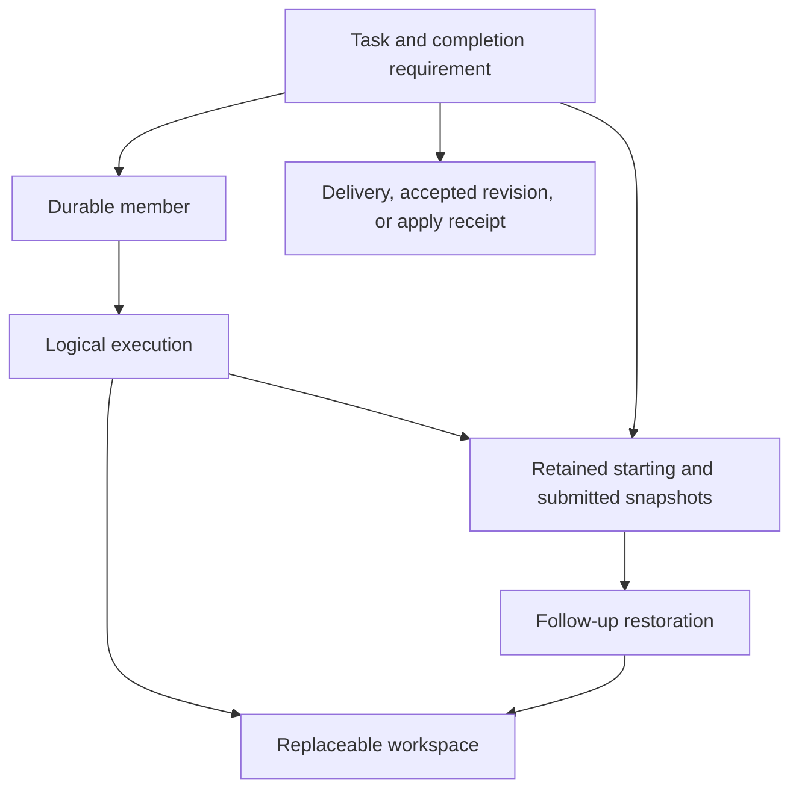
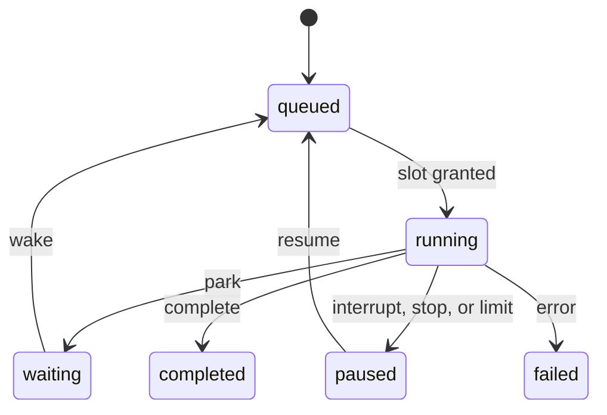

# Swarm state model, format 2

This page describes the state model implemented in this revision. Start with
[the workflow guide](../WORKFLOWS.md) for parent actions. The
[API reference](../API.md#format-2-records) owns field names and return shapes;
[the completed design note](task-first-swarm.md) explains the decisions.

## Durable work and replaceable resources

A task keeps the obligation and its evidence. A member keeps the identity,
conversation, and authority. An execution keeps one logical turn and its budget.
A workspace provides files and bindings for that execution. Releasing files does
not remove the member or undo a completed task.

Member pointers select current work; task and execution provenance identify the
historical source. Never infer a submitted task's base from whichever workspace
its member happens to use now. Snapshots and published artifacts outlive workspace
release. Snapshot refs remain until explicit forgetting; SQLite history follows
parent retention. Parent deletion or TTL does not remove Git worktrees or refs.

## Persisted states

These strings belong to separate records. They are not interchangeable agent
statuses, and no single one decides whether the parent can finish.

| Record | States / values | Meaning |
| --- | --- | --- |
| Task | `pending`, `running`, `blocked`, `changes_requested`, `awaiting_review`, `done`, `canceled` | Assignment and completion disposition. |
| Task requirement | `delivered`, `reviewed`, `applied` | Creation-time obligation, fixed for the task's life. |
| Execution | `queued`, `running`, `waiting`, `paused`, `completed`, `failed` | Scheduler outcome for one logical turn. |
| Member control | Empty or `stopped` | Explicit stop/resume intent; workspace release is independent. |
| Context release | Empty, `releasing`, `retained` | Resource cleanup progress or reason to preserve files. After release the context record is absent. |
| Run | `running`, `paused`, `completed` | Shared logical-start budget and settlement scope. |
| Workflow | `running`, `completed`, `failed`, `interrupted` | A fresh JavaScript attempt; cancellation produces interruption. Terminal handling also recognizes stored `canceled` reports. |
| Workflow step | `running`, `completed`, `failed`, `interrupted` | A saved host operation intent and outcome. |
| Integration candidate | `ready`, `conflicted`, `superseded`, `applied` | Ordered proposed integration, including repairs and pending inputs. |
| Apply record | `applying`, `applied`, `not_applied`, `recovery_required` | Durable write intent or reconciled filesystem outcome. |

The [task diagram](../WORKFLOWS.md#tasks-members-executions-and-workspaces) shows
completion paths. The [workspace diagram](../WORKFLOWS.md#workspace-release-and-restoration)
uses conceptual `created`, `in use`, and `released` labels in addition to the two
persisted release values. It does not introduce extra stored enum values.

Interruption or stop can also pause a queued or waiting execution.
A wait and a paused-execution resume retain the execution ID, consumed calls, and
captured limit. Resuming a completed/failed member starts a new execution; it is
not a transition of the old outcome back to running. Generation fencing prevents
late completions from overwriting newer or reassigned work.

## Completion evidence

For `delivered`, capture alone is insufficient. The task remains `running` after
its execution completes until one of two durable checkpoints records the exact
revision and execution: parent admission of a result notice (`mail`), or a saved
completed `agent`/`followup` step (`workflow_step`). The latter commits before
JavaScript resumes. Failed steps and inspector reads are not delivery evidence.
Missing step receipts get replacement mail on workflow termination or recovery.
Large-result delivery records whether the result was inline; a preview and retrieval
reference do not certify that all bytes were read.

For `reviewed`, the parent accepts the submitted revision. Feedback requests more
work. For `applied`, `swarm_integrate` accepts exact revisions and finishes changed
contributions only after confirmed application. Immutable equality between starting
and submitted trees permits unchanged completion without an apply. Task acceptance
can survive a conflict while the candidate remains halted; acceptance alone does
not prove changed work reached the parent.

A completed workflow's output is acknowledged at its parent checkpoint. Failed or
interrupted reports need explicit handling. Delivered research stays done when a
later workflow step fails. Deferral records exact unresolved facts and a note;
it does not manufacture acceptance, integration, or dependency completion.

## Resource reclamation

A member workspace is automatically eligible only when every owned task is done
or canceled, no execution is queued/running/waiting/paused, no invocation uses it,
no active workflow reserves the member, and no uncertain apply involves it.
Filesystem proof then checks the base tree or an exact completed editing tree.
Workflow-owned validation copies use explicit `polly.release`.

Cleanup marks `releasing` before filesystem work and clears the member pointer only
after removal. Bindings close first. Unintegrated edits become `retained`; other
cleanup failures are retried and become retained after three failures. Automatic
passes skip retained contexts; inspection and explicit cleanup provide recovery.
A release failure affects resources, not completed task status.

A follow-up creates a linked task on the same member. Read-only defaults to the
original starting snapshot; editing defaults to the completed submitted snapshot.
An explicit known snapshot refreshes only the new task. Missing resources are
recreated; mismatched live resources or missing provenance refuse the launch.
Non-Git research uses its original live root with fresh scratch and has no
historical-content guarantee.

## Derived presentation and settlement

`MemberState` and `ParentState` derive `idle`, `active`, `waiting`, or `paused` plus
a detail. The parent is derived from the current turn's live work; archived views
without a runtime omit it. Approval is a UI overlay. No presentation label is stored.

| Durable facts | Parent-facing interpretation | Next action |
| --- | --- | --- |
| Execution completed; delivered result lacks receipt | `idle · delivering` | Admit the result, or wait for the remaining batch. |
| Reviewed task awaiting acceptance | `idle · awaiting review` | Accept the exact revision or request changes. |
| Editing revision accepted; ready candidate | `idle · integration pending` | Integrate the candidate. |
| Unresolved editing contribution in a conflicted candidate | `idle · integration halted` | Repair the candidate from its exact intermediate snapshot. |
| Task done; context absent | Done task and dormant member | Use the result or start a follow-up. |
| Task done; context retained | Done task and retained workspace | Inspect the cleanup reason. |
| Execution paused at its call limit | `paused · iteration limit` | Explicit host/user grant or another resolution. |

`deriveFacts` produces one source for two independent consumers: settlement sees
all obligations; presentation groups them into decisions, working items, and
counts. Running workflows fold their own members; candidate inputs fold into one
integration decision. That grouping never changes settlement.

Settlement prioritizes uncertain applies and undelivered parent requests/replies,
then delivery, budget, unresolved tasks, and terminal workflow failures. It waits
while execution or host work can progress. Purely parked members cannot make an
answer safe by themselves; unresolved work needs an event or decision. The harness
repairs missing notices and accepted unchanged completion. An unchanged notice
scan performs no coordination write, so it cannot wake its own wait loop.

The implementation boundaries are [decisions.go](../swarm/decisions.go),
[lifecycle.go](../swarm/lifecycle.go), [runtime.go](../swarm/runtime.go),
[delivery.go](../swarm/delivery.go), [integrate.go](../swarm/integrate.go), and
[workspace_release.go](../swarm/workspace_release.go). These sources, rather than
presentation strings, define the transition guards.
